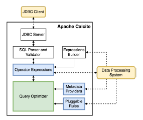
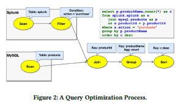
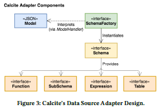
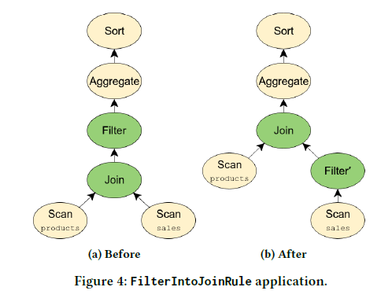
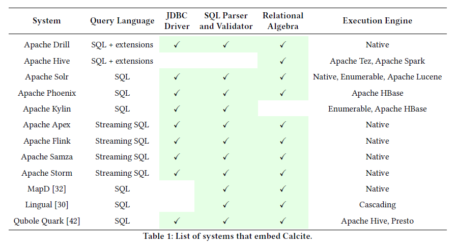
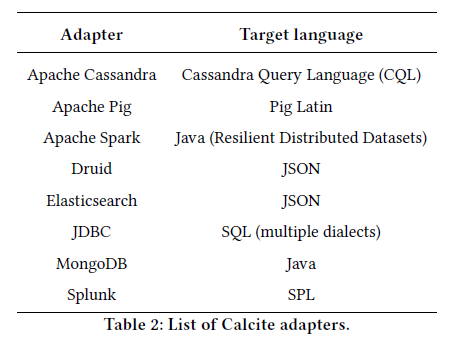

# Apache Calcite: A Foundational Framework for Optimized Query Processing Over Heterogeneous Data Sources

Edmon Begoli, Oak Ridge National Laboratory, (ORNL), Oak Ridge, Tennessee, USA, begolie@ornl.gov  
Jesús Camacho-Rodríguez, Hortonworks Inc., Santa Clara, California, USA, jcamacho@hortonworks.com  
Julian Hyde, Hortonworks Inc., Santa Clara, California, USA, jhyde@hortonworks.com  
Michael J. Mior, David R. Cheriton School of Computer Science University of Waterloo Waterloo, Ontario, Canada, mmior@uwaterloo.ca  
Daniel Lemire, University of Quebec (TELUQ), Montreal, Quebec, Canada, lemire@gmail.com  

Publication rights licensed to ACM. ACM acknowledges that this contribution was authored or co-authored by an employee, contractor or affiliate of the United States government. As such, the Government retains a nonexclusive, royalty-free right to publish or reproduce this article, or to allow others to do so, for Government purposes only.
SIGMOD’18, June 10–15, 2018, Houston, TX, USA  
© 2018 Copyright held by the owner/author(s). Publication rights licensed to the Association for Computing Machinery.  
ACM ISBN 978-1-4503-4703-7/18/06. . . $15.00  
https://doi.org/10.1145/3183713.3190662

## 摘要
Apache Calcite 是一个基础软件框架，它为许多流行的开源数据处理系统（如 Apache Hive、Apache Storm、Apache Flink、Druid 和 MapD）提供查询处理、优化和查询语言支持。 Calcite 的架构包括一个模块化和可扩展的查询优化器，内置数百条优化规则，一个能够处理多种查询语言的查询处理器，一个为可扩展性设计的适配器架构，以及对异构数据模型和存储（关系、半-结构化、流式传输和地理空间）。这种灵活、可嵌入和可扩展的架构使 Calcite 成为大数据框架采用的有吸引力的选择。这是一个活跃的项目，将继续引入对新型数据源、查询语言以及查询处理和优化方法的支持。

## CCS 概念
* 信息系统 → DBMS 引擎架构；

## 关键词
Apache Calcite、关系语义学（Relational Semantics）、数据管理（Data Management）、查询代数（Query Algebra）、模块化查询优化（Modular Query Optimization）、存储适配器（Storage Adapters）

## 1 介绍
继开创性的 System R 之后，传统的关系数据库引擎主导了数据处理领域。然而，早在 2005 年，Stonebraker 和Çetintemel [49] 预测我们将看到一系列专业引擎的兴起，例如列存储、流处理引擎、文本搜索引擎等。他们认为专用引擎可以提供更具成本效益的性能，并且这些引擎将终结“一刀切”的范式。他们的愿景在今天似乎比以往任何时候都更加重要。事实上，许多专门的开源数据系统已经变得流行起来，例如 Storm [50] 和 Flink [16]（流处理），Elasticsearch [15]（文本搜索）、Apache Spark [47]，德鲁伊 [14] 等。由于组织已投资于针对其特定需求量身定制的数据处理系统，因此出现了两个首要问题：
* 此类专业系统的开发人员遇到了相关问题，例如查询优化 [4, 25] 或需要支持查询语言，例如 SQL 和相关扩展（例如，流式查询 [26]) 以及受 LINQ 启发的语言集成查询 [33]。如果没有统一的框架，让多个工程师独立开发类似的优化逻辑和语言支持会浪费工程精力。
* 使用这些专用系统的程序员通常必须将其中的几个集成在一起。一个组织可能依赖 Elasticsearch、Apache Spark 和 Druid。我们需要构建能够支持跨异构数据源的优化查询的系统[55]。

Apache Calcite 就是为了解决这些问题而开发的。它是一个完整的查询处理系统，提供了任何数据库管理系统所需的许多常见功能——查询执行、优化和查询语言，但数据存储和管理除外，这些功能留给专门的引擎处理。 Calcite 很快被 Hive、Drill [13]、Storm 等许多数据处理引擎，为它们提供高级查询优化和查询语言。1例如，Hive [24] 是一个建立在 Apache Hadoop 之上的流行数据仓库项目。随着 Hive 从其批处理基础转向交互式 SQL 查询回答平台，很明显该项目需要一个强大的核心优化器。因此，Hive 采用 Calcite 作为其优化器，此后它们的集成一直在增长。许多其他项目和产品也纷纷效仿，包括 Flink、MapD[12], 等等。 

此外，Calcite 通过向多个系统公开通用接口来实现跨平台优化。为了提高效率，优化器需要全局推理，例如，跨不同系统做出关于物化视图选择的决策。
建立一个共同的框架并非没有挑战。特别是，该框架需要具有足够的可扩展性和灵活性，以适应需要集成的不同类型的系统。
我们相信以下特性有助于 Cals 在开源社区和行业中的广泛采用：
* 开源友好。过去十年的许多主要数据处理平台要么是开源的，要么主要基于开源。 Calcite 是一个开源框架，由 Apache 软件基金会 (ASF) [5]，它提供了协作开发项目的方法。此外，该软件是用 Java 编写的，因此更容易与许多最新的数据处理系统进行互操作 [12, 13, 16, 24, 28, 44] 通常是用 Java（或基于 JVM 的 Scala）编写的，尤其是那些在 Hadoop 生态系统中的。
* 多种数据模型。 Calcite 提供查询支持流和传统数据处理范例的优化和查询语言。 Calcite 将流视为按时间排序的记录或事件集，它们不会像在传统数据处理系统中那样持久化到磁盘上。
* 灵活的查询优化器。优化器的每个组件都是可插拔和可扩展的，范围涉及规则到成本模型。此外，Calcite 还支持多种规划引擎。因此，优化可以分解为由不同优化引擎处理的阶段，具体取决于哪个最适合该阶段。
* 跨系统支持。 Calcite 框架可以运行和优化跨多个查询处理系统和数据库的后端查询。
* 可靠性。Calcite是可靠的，因为它多年来被广泛采用，对该平台进行了详尽的测试。 Calcite 还包含一个广泛的测试套件，用于验证系统的所有组件，包括查询优化器规则和与后端数据源的集成。
* 支持 SQL 及其扩展。许多系统不提供自己的查询语言，但更喜欢依赖现有的查询语言，例如 SQL。对于这些，Calcite 提供对 ANSI 标准 SQL 以及各种 SQL 方言和扩展的支持，例如，用于表达对流式或嵌套数据的查询。此外，Calcite 包括一个符合标准 Java API (JDBC) 的驱动程序。

其余部分组织如下。部分2 讨论相关工作。部分3 介绍 Calcite 的架构及其主要组件。部分4 描述了 Calcite 核心的关系代数。部分5 介绍 Calcite 的适配器，一种定义如何读取外部数据源的抽象。随之，部分6 描述 Calcite 的优化器及其主要功能，而 Section7 介绍了处理不同查询处理范例的扩展。部分8 提供了使用Calcite数据处理系统的概述。部分9 讨论框架未来可能的扩展，部分10做总结.

## 2 相关工作
尽管 Calcite 目前是 Hadoop 生态系统中使用最广泛的大数据分析优化器，但其背后的许多想法并不新颖。例如，查询优化器建立在 Volcano [20] 和Cascades [19] 框架的思想之上，结合了其他广泛使用的优化技术，例如物化视图重写 [10, 18, 22]。还有其他系统尝试扮演与Calcite类似的角色。

Orca[45] 是一种模块化查询优化器，用于 Greenplum 和 HAWQ 等数据管理产品。 Orca 通过实现一个在两者之间交换信息的框架（称为数据交换语言）将优化器与查询执行引擎分离。 Orca 还提供了用于验证生成的查询计划的正确性和性能的工具。与 Orca 相比，Calcite 可以用作独立的查询执行引擎，它联合多个存储和处理后端，包括可插入的规划器和优化器。

Spark SQL [3] 扩展了 Apache Spark 以支持 SQL 查询执行，它还可以像 Calcite 中一样在多个数据源上执行查询。然而，尽管 Spark SQL 中的 Catalyst 优化器也试图最小化查询执行成本，但它缺乏 Calcite 使用的动态编程方法，并且有陷入局部最小值的风险。

逻辑代数。然后，Algebricks [6] 是一种查询编译器架构，它为大数据查询处理提供了与数据模型无关的代数层和编译器框架。高级语言被编译为 Algebricks 逻辑代数。然后，Algebricks 生成针对 Hyracks 并行处理后端的优化作业。虽然 Calcite 与 Algebricks 都采用了模块化方法，但 Calcite 还包括对基于成本的优化的支持。在当前版本的 Calcite 中，查询优化器架构使用基于 Volcano 的基于动态规划的规划 [20] 具有多阶段优化的扩展，如 Orca [45]。尽管原则上 Algebricks 可以支持多个处理后端（例如 Apache Tez、Spark），但 Calcite 多年来一直为各种后端提供经过充分测试的支持。

Garlic [7]是一个异构数据管理系统，它在一个统一的对象模型下表示来自多个系统的数据。但是，Garlic 不支持跨不同系统的查询优化，而是依赖每个系统来优化自己的查询。

FORWARD [17] 是一个联合查询处理器，它实现了一个名为 SQL++ [38]。 SQL++ 具有集成 JSON 和关系数据模型的半结构化数据模型，而 Calcite 通过在查询计划期间在关系数据模型中表示半结构化数据模型来支持半结构化数据模型。 FORWARD 将 SQL++ 编写的联邦查询分解为子查询，并根据查询计划在底层数据库上执行。数据的合并发生在 FORWARD 引擎内部。

另一个联邦数据存储和处理系统是 BigDAWG，它抽象了广泛的数据模型，包括关系、时间序列和流。BigDAWG的抽象单位被称为信息岛（island of information）。每个信息岛都有一种查询语言、数据模型并连接到一个或多个存储系统。在单个信息岛的边界内支持跨存储系统查询。 Calcite 相反提供了一个统一的关系抽象，它允许使用不同的数据模型跨后端进行查询。

Myria 是用于大数据分析的通用引擎，具有对 Python 语言的高级支持 [21]。它为 Spark 和 PostgreSQL 等其他后端引擎生成查询计划。

## 3 架构
Calcite 包含许多组成典型数据库管理系统的部分。但是，它省略了一些关键组件，例如数据存储、处理数据的算法以及用于存储元数据的存储库。这些遗漏是故意的：它使 Calcite 成为在具有一个或多个数据存储位置并使用多个数据处理引擎的应用程序之间进行调解的绝佳选择。它也是构建定制数据处理系统的坚实基础。

图1 概述了Calcite架构的主要组成部分。 Calcite 的优化器使用关系运算符树作为其内部表示。优化引擎主要由三个组件组成：规则、元数据提供者和计划引擎。我们将在章节中更详细地讨论这些组件6. 在图中，虚线表示与框架可能的外部交互。有不同的方式与Calcite进行交互。

首先，Calcite 包含一个查询解析器和验证器，可以将 SQL 查询转换为关系运算符树。由于 Calcite 不包含存储层，它提供了一种机制来通过适配器在外部存储引擎中定义表模式和视图（第5节中说明), 所以它可以在这些引擎之上使用。

其次，虽然 Calcite 为需要此类数据库语言支持的系统提供了优化的 SQL 支持，但它也为已经拥有自己的语言的系统提供了解析和解释的优化支持：
* 一些系统支持 SQL 查询，但是缺少或仅支持有限的查询优化。例如，Hive 和 Spark 最初都提供对 SQL 语言的支持，但它们不包含优化器。对于这种情况，一旦优化了查询，Calcite 就可以将关系表达式转换回 SQL。此功能允许 Calcite 在任何具有 SQL 接口但没有优化器的数据管理系统之上作为独立系统工作。
* Calcite 架构不仅针对优化 SQL 查询而量身定制。数据处理系统通常选择将自己的解析器用于自己的查询语言。 Calcite 也可以帮助优化这些查询。实际上，Calcite 还允许通过直接实例化关系运算符来轻松构建运算符树。可以使用内置的关系表达式构建器接口。例如，假设我们要表达以下 Apache Pig[41] 使用表达式生成器的脚本：

    emp = LOAD 'employee_data ' AS (deptno , sal );  
    emp_by_dept = GROUP emp by ( deptno );  
    emp_agg = FOREACH emp_by_dept GENERATE GROUP as deptno ,  
        COUNT (emp.sal) AS c, SUM(emp.sal) as s;  
    dump emp_agg ;  

对应等价的表达式如下：

    final RelNode node = builder  
        .scan ("employee_data")  
        .aggregate(builder.groupKey ("deptno"),  
            builder.count (false , "c"),  
            builder.sum(false , "s", builder . field ("sal ")))  
    .build ();

该接口公开了构建关系表达式所需的主要结构。优化阶段完成后，应用程序可以检索优化的关系表达式，然后将其映射回系统的查询处理单元。

## 4 查询代数
**运算符（Operators）。** 关系代数 [11] 位于Calcite的核心。除了表达最常见的数据操作操作的运算符，如过滤器、项目、连接等，Calcite还包括满足不同目的的其他运算符，例如，能够简洁地表示复杂的操作，或者更有效地识别优化机会。  
例如，OLAP、决策制定和流应用程序使用窗口定义来表达复杂的分析函数已变得很常见，比如一段时间内数量或行数的移动平均值。因此，Calcite 引入了一个窗口（window）运算符，它封装了窗口定义，即上限和下限、分区等，以及在每个窗口上执行的聚合函数。

**特征（Traits，或者特征策略）。** Calcite 不使用不同的实体来表示逻辑和物理运算符。相反，它使用特征描述了与运算符相关的物理属性。这些特征有助于优化器评估不同替代计划的成本。更改特征值不会更改正在评估的逻辑表达式，即给定运算符生成的行仍然是相同的。 

在优化过程中，Calcite 尝试对关系表达式强制执行某些特征，例如，某些列的排序顺序。关系运算符可以实现一个转换器接口，该接口指示如何将表达式的特征从一个值转换为另一个值。

Calcite 包括描述由关系表达式生成的数据的物理属性的常见特征，例如排序、分组和分区。类似于 SCOPE 优化器 [57]，Calcite优化器可以推理这些属性并利用它们找到避免不必要操作的计划。例如，如果排序运算符的输入已经正确排序（可能是因为这与后端系统中用于行的顺序相同），则可以删除排序操作。

除了这些属性之外，Calcite 的主要特征之一是调用约定特性。本质上，特征表示将执行表达式的数据处理系统。将调用约定作为一个特征包含在内允许 Calcite 实现其透明优化查询的目标，这些查询的执行可能跨越不同的引擎，即约定将被视为任何其他物理属性。

例如，考虑将 MySQL 中的 Products 表连接到 Splunk 中的 Orders 表（见图2). 最初，订单扫描在 splunk 约定中进行，产品扫描在 jdbc-mysql 约定中进行。这些表必须在其各自的引擎中进行扫描。连接符合逻辑约定，这意味着没有选择任何实现。此外，图中的 SQL 查询2 包含一个过滤器（where 子句），该过滤器由特定于适配器的规则推入 splunk（请参阅第5节)。 一种可能的实现是使用 Apache Spark 作为外部引擎：join 被转换为 spark 约定，其输入是从 jdbc-mysql 和 splunk 到 spark 约定的转换器。但是有一个更有效的实现：利用 Splunk 可以通过 ODBC 执行对 MySQL 的查找这一事实，规划器规则通过 splunk-to-spark 转换器推送连接，并且连接现在采用 splunk 约定，在 Splunk 引擎内部运行。

## 5 适配器
适配器（adapter）是一种架构模式，它定义了 Calcite 如何合并各种数据源以进行一般访问。图3 描绘了它的组成部分。本质上，适配器由模型、schema和schema工厂组成。模型（model）是指正在访问的数据源的物理属性（？）的规范。schema是指在模型中找到的数据（格式和布局）的定义。数据本身是通过表进行物理访问的。Calcite接口使用适配器中定义的表，在执行查询时读取数据。适配器可以定义一组添加到规划器（planner）的规则（rules）。例如，它通常包括将各种类型的逻辑关系表达式转换为适配器约定的相应关系表达式的规则。schema工厂组件从模型中获取元数据信息并生成schema。

如第4节所述, Calcite 使用称为调用约定（calling convention）的物理特征来识别对应于特定数据库后端的关系运算符。这些物理运算符实现每个适配器中基础表的访问路径。解析查询并将其转换为关系代数表达式时，将为每个表创建一个运算符，表示对该表上数据的扫描。它是适配器必须实现的最小接口。如果适配器实现了表扫描运算符，那么 Calcite 优化器就能够使用客户端的运算符（例如排序、过滤和连接）对这些表执行任意 SQL 查询。

此表扫描运算符包含适配器向适配器的后端数据库发出扫描所需的必要信息。为了扩展适配器提供的功能，Calcite 定义了一个可枚举的调用约定。具有可枚举调用约定的关系运算符只需通过迭代器接口对元组进行操作。此调用约定允许 Calcite 实现每个适配器后端可能不可用的运算符。例如，EnumerableJoin 运算符通过从其子节点收集行并关联所需的属性来实现连接（join）。

对于只涉及表中一小部分数据的查询，Calcite 枚举所有元组的效率很低。幸运的是，可以使用相同的基于规则的优化器来实现特定于适配器的优化规则。例如，假设查询涉及对表进行过滤和排序。支持在后端执行过滤的适配器可以实现与 LogicalFilter 匹配的规则并将其转换为适配器的调用约定。此规则将 LogicalFilter 转换为另一个 Filter 实例。这个新的过滤器节点具有较低的关联成本，允许 Calcite 跨适配器优化查询。

适配器的使用是一种强大的抽象，它不仅可以优化特定后端的查询，还可以跨多个后端进行查询。 Calcite 能够通过将所有可能的逻辑下推到每个后端来回应涉及跨多个后端表的查询，然后对结果数据执行连接和聚合。实现适配器可以像提供表扫描运算符一样简单，也可以涉及许多高级优化的设计。关系代数中表示的任何表达式都可以通过优化器规则下推到适配器。

## 6 查询处理和优化
查询优化器是框架中的主要组件。Calcite 通过将规划器规则重复应用于关系表达式来优化查询。成本模型指导该过程，并且计划引擎尝试生成与原始语义相同但成本较低的替代表达式。

优化器中的每个组件都是可扩展的。用户可以添加关系运算符、规则、成本模型和统计信息。

**规划器规则。** Calcite 包含一组规划器规则来转换表达式树。特别是，规则匹配树中的给定模式并执行保留该表达式语义的转换。 Calcite 包含数百个优化规则。然而，对于依赖 Calcite 进行优化的数据处理系统来说，包含自己的规则以允许特定的重写是相当常见的。

例如，Calcite 为 Apache Cassandra [29]，一种宽列存储，它按表中的列子集对数据进行分区，然后在每个分区内，根据另一个列子集对行进行排序。如部分所述5, 适配器将尽可能多的查询处理下推到每个后端以提高效率是有益的。将排序推送到 Cassandra 的规则必须检查两个条件：

  （1） 该表之前已被过滤到单个分区（因为行仅在分区内排序）和  
  （2） Cassandra 中的分区排序有一些与所需排序相同的前缀。

这需要将 LogicalFilter 重写为 CassandraFilter 以确保将分区过滤器下推到数据库中。规则的效果很简单（将 LogicalSort 转换为 CassandraSort），但规则匹配的灵活性使后端即使在复杂的场景中也可以下推算子。

有关具有更复杂效果的规则示例，请考虑以下查询：  

    SELECT products .name , COUNT ( * )  
    FROM sales JOIN products USING ( productId )  
    WHERE sales . discount IS NOT NULL  
    GROUP BY products . name  
    ORDER BY COUNT ( * ) DESC;

该查询对应于图中所示的关系代数表达式4a. 因为 WHERE 子句只适用于 sales 表，所以我们可以将过滤器移到 join 之前，如图4b. 这种优化可以显着减少查询执行时间，因为我们不需要对匹配谓词的行执行连接。此外，如果 sales 和 products 表包含在单独的后端中，则在连接之前移动过滤器也可能使适配器能够将过滤器推送到后端。 Calcite 通过 FilterIntoJoinRule 实现此优化，该规则将过滤器节点与作为父节点的连接节点匹配，并检查连接是否可以执行过滤器。这种优化说明了 Calcite 优化方法的灵活性。

**元数据提供者。** 元数据是 Calcite 优化器的重要组成部分，它有两个主要目的：（i）引导规划器实现降低整体查询计划成本的目标，以及（ii）在规则应用时为规则提供信息。

元数据提供者负责将该信息提供给优化器。具体来说，Calcite 中的默认元数据提供程序实现包含返回在运算符树中执行子表达式的总成本、该表达式结果的行数和数据大小以及最大并行度的函数。可以执行。反过来，它还可以提供有关计划结构的信息，例如，过滤条件出现在某个树节点下方。

Calcite 提供允许数据处理系统将其元数据信息插入框架的接口。这些系统可能会选择编写覆盖现有功能的提供程序，或者提供可能在优化阶段使用的自己的新元数据功能。然而，对于他们中的许多人来说，提供有关其输入数据的统计信息就足够了，例如，表的行数和大小，给定列的值是否唯一等，然后 Calcite 将完成剩下的工作使用其默认实现。

由于元数据提供程序是可插入的，它们在运行时使用 Janino [27]，一个Java轻量级编译器。它们的实现包括用于元数据结果的缓存，这会产生显着的性能改进，例如，当我们需要计算多种类型的元数据（例如基数、平均行大小和给定连接的选择性）时，所有这些计算都依赖于他们的投入。

**计划引擎。** 计划引擎的主要目标是触发提供给引擎的规则，直到它达到给定的目标。目前，Calcite 提供了两种不同的引擎。新引擎可插入框架中。

第一个是基于成本的规划器（cost-based planner）引擎，它触发输入规则，目的是降低整体表达式成本。该引擎使用动态编程算法，类似于 Volcano [20]，创建和跟踪通过触发传递给引擎的规则。最初，每个表达式与基于表达式属性及其输入的摘要一起注册到规划器中。当在表达式  e1 上触发规则并且该规则生成新的表达式 e2时，规划器会将 e2 添加到 e1 所属的等价表达式集合 Sa 中。此外，规划器为新表达式生成一个摘要，并将其与先前在规划器中注册的那些进行比较。如果找到与属于集合 Sb的表达式 e3相关联的类似摘要，则计划器已找到重复项，因此会将 Sa 和 Sb合并到新的等价集合中。该过程继续进行，直到规划器达到可配置的固定点。特别是，它可以 (i) 彻底探索搜索空间，直到所有规则都应用于所有表达式，或 (ii) 当计划成本在最后一次计划器迭代中的改进幅度未超过给定阈值 δ 时，使用基于启发式的方法停止搜索。 决定优化器选择哪个计划的成本函数是通过元数据提供者提供的。默认成本函数实现结合了对给定表达式使用的 CPU、IO 和内存资源的估计。

第二个引擎是一个穷举计划器（exhaustive planner），它穷举地触发规则，直到它生成一个不再被任何规则修改的表达式。此规划器可用于快速执行规则，而无需考虑每个表达式的成本。

用户可以根据他们的具体需求选择使用现有的规划器引擎之一，并且当他们的系统需求发生变化时，从一个引擎切换到另一个引擎很简单。或者，用户可以选择生成多阶段优化逻辑，其中在优化过程的连续阶段应用不同的规则集。重要的是，两个计划器的存在允许 Calcite 用户通过指导搜索不同的查询计划来减少整体优化时间。

**物化视图。** 在数据仓库中加速查询处理的最强大的技术之一是相关汇总或物化视图的预计算。多个 Calcite 适配器和依赖于 Calcite 的项目有自己的物化视图概念。例如，Cassandra 允许用户根据系统自动维护的现有表定义物化视图。

这些引擎将它们的物化视图暴露给 Calcite。然后优化器有机会重写传入的查询以使用这些视图而不是原始表。特别是，Calcite 提供了两种不同的基于物化视图的重写算法的实现。

第一种方法是基于视图替换[10, 18]。目的是用使用物化视图的等价表达式替换关系代数树的一部分，算法进行如下：（i）物化视图上的扫描算子和物化视图定义计划注册到计划器，以及 (ii) 尝试统一计划中的表达式的转换规则被触发。视图不需要完全匹配被替换的查询中的表达式，因为 Calcite 中的重写算法可以产生部分重写，其中包括额外的运算符来计算所需的表达式，例如，具有残留谓词条件的过滤器。

第二种方法是基于格子（lattices）[22]。一旦声明数据源形成了一个格子，Calcite将每个物化表示为一个瓷砖（tile），而优化器又可以使用它来回应传入的查询。一方面，重写算法在匹配以星型模式组织的数据源上的表达式时特别有效，这在 OLAP 应用程序中很常见。另一方面，它比视图替换更具限制性，因为它对底层模式施加了限制。

## 7 扩展Calcite
正如我们在前几节中提到的，Calcite不仅针对 SQL 处理量身定制。事实上，Calcite 提供了对 SQL 的扩展，用于表达对其他数据抽象的查询，例如半结构化数据、流数据和地理空间数据。它的内部运算符适应这些查询。除了对 SQL 的扩展之外，Calcite 还包括一种语言集成的查询语言。我们将在本节中描述这些扩展并提供一些示例。

### 7.1 半结构化数据
Calcite 支持多种复杂的列数据类型，这些类型可以将关系数据和半结构化数据混合存储在表中。具体来说，列的类型可以是 ARRAY、MAP 或 MULTISET。此外，这些复杂类型可以嵌套，例如，可以有一个值是 ARRAY 类型的 MAP。可以使用 [] 运算符提取 ARRAY 和 MAP 列中的数据（以及其中的嵌套数据）。不需要预先定义存储在任何这些复杂类型中的特定类型的值。
例如，Calcite 包含一个用于 MongoDB [36]的适配器，MongoDB是一个文档存储，存储由大致相当于 JSON 文档的数据组成的文档。为了将 MongoDB 数据暴露给 Calcite，为每个文档集合创建一个表，其中包含一个名为 _MAP 的列：文档标识符到其数据的映射。在许多情况下，可以期望文档具有共同的结构。代表邮政编码的文档集合可能每个都包含带有城市名称、纬度和经度的列。将此数据公开为关系表会很有用。在 Calcite 中，这是通过在提取所需的值并将它们转换为适当的类型后创建一个视图来实现的：  

    SELECT CAST ( _MAP ['city '] AS varchar (20)) AS city ,
    CAST ( _MAP ['loc '][0] AS float ) AS longitude ,
    CAST ( _MAP ['loc '][1] AS float ) AS latitude
    FROM mongo_raw.zips ;

通过以这种方式定义的半结构化数据视图，可以更轻松地处理来自不同半结构化源的数据以及关系数据。

### 7.2 Streaming
Calcite 为流式查询提供一流的支持 [26]。基于标准 SQL 的一组特定于流的扩展，即 STREAM 扩展、窗口扩展、通过连接中的窗口表达式对流的隐式引用等。这些扩展的灵感来自于连续查询语言 [2]，同时尝试与标准 SQL 有效集成。主要的扩展了STREAM 指令，告诉系统用户对传入记录感兴趣，而不是现有记录。

    SELECT STREAM rowtime , productId , units
    FROM Orders
    WHERE units > 25;
 
在查询流时没有 STREAM 关键字的情况下，查询变成常规的关系查询，表明系统应该处理已经从流中接收到的现有记录，而不是传入的记录。

由于流固有的无界特性，窗口化用于解除阻塞操作符，例如聚合和连接。 Calcite 的流扩展使用 SQL 分析函数来表示滑动和级联（sliding and cascading）窗口聚合，如下例所示。

    SELECT STREAM rowtime ,
    productId ,
    units ,
    SUM( units ) OVER ( ORDER BY rowtime
    PARTITION BY productId
    RANGE INTERVAL '1' HOUR PRECEDING ) unitsLastHour
    FROM Orders ;

Tumbling, hopping, sliding, and session windows是用于对流事件进行分组的不同方案[35]，Tumbling、hopping、和session窗口由 TUMBLE、HOPPING、SESSION 函数和相关实用程序函数（如 TUMBLE_END 和 HOP_END）指定，这些函数可分别用于 GROUP BY 子句和投影。

    SELECT STREAM
    TUMBLE_END ( rowtime , INTERVAL '1' HOUR ) AS rowtime ,
    productId ,
    COUNT (*) AS c,
    SUM( units ) AS units
    FROM Orders
    GROUP BY TUMBLE ( rowtime , INTERVAL '1' HOUR ), productId ;

涉及窗口聚合的流查询要求在 GROUP BY 子句或 ORDER BY 子句中存在单调或准单调表达式（如果是滑动和级联窗口查询）。

涉及更复杂的流到流连接的流查询可以使用 JOIN 子句中的隐式（时间）窗口表达式进行表示。

    SELECT STREAM o. rowtime , o. productId , o. orderId ,
    s. rowtime AS shipTime
    FROM Orders AS o
    JOIN Shipments AS s
    ON o. orderId = s. orderId
    AND s. rowtime BETWEEN o. rowtime AND
    o. rowtime + INTERVAL '1' HOUR ;

对于隐式窗口，Calcite 的查询计划程序会验证表达式是否单调。

### 7.3 地理空间查询
地理空间支持在Calcite中是初步的，但正在使用Calcite的关系代数实现。此实现的核心包括添加新的 GEOMETRY 数据类型，该数据类型封装不同的几何对象，如点、曲线和多边形。预计Calcite将完全符合OpenGIS简单功能访问[39] 规范，该规范定义了用于访问地理空间数据的 SQL 接口的标准。示例查询查找包含阿姆斯特丹市的国家/地区：

    SELECT name FROM (
    SELECT name ,
    ST_GeomFromText ('POLYGON ((4.82 52.43 , 4.97 52.43 , 4.97 52.33 ,
    4.82 52.33 , 4.82 52.43)) ') AS " Amsterdam ",
    ST_GeomFromText ( boundary ) AS " Country "
    FROM country
    ) WHERE ST_Contains (" Country ", " Amsterdam ");

### 7.4 Java 语言集成查询
Calcite可用于查询多个数据源，而不仅仅是关系数据库。但它也旨在支持不仅仅是SQL语言。虽然SQL仍然是主要的数据库语言，但许多程序员更喜欢语言集成语言，如LINQ [33]。与嵌入在Java或C++代码中的SQL不同，语言集成的查询语言允许程序员使用一种语言编写所有代码。Calcite为Java（简称LINQ4J）提供了语言集成查询，它严格遵循Microsoft的LINQ为.NET语言制定的约定。

## 8 行业和学术界的采用
Calcite被广泛采用，特别是在工业中使用的开源项目中。由于Calcite提供了一定的集成灵活性，这些项目选择（i）将Calcite嵌入其核心，即将其用作库，或（ii）实现适配器以允许Calcite联合查询处理。此外，我们看到研究界越来越有兴趣使用Calcite作为数据管理项目开发的基石。在下文中，我们将描述不同的系统如何使用Calcite。

### 8.1 嵌入式Calcite
表1 提供了将Calcite作为开发库的软件列表，包括（i）它们向用户公开的查询语言界面，（ii）它们是否使用了Calcite的JDBC驱动程序（称为Avatica），（iii）它们是否使用Calcite中包含的SQL解析器和验证器，（iv）它们是否使用Calcite的查询代数来表示它们对数据的操作，（v）他们依赖执行的引擎，例如，他们自己的本地引擎、Calcite的执行器（也称为 enumerable）或任何其他的项目。
Drill [13]是基于Dremel系统的灵活数据处理引擎[34]，在内部使用无架构 JSON 文档数据模型。Drill 使用自己的 SQL 方言，其中包括用于表达对半结构化数据的查询的扩展，类似于 SQL++[38]。
Hive [24]首先作为MapReduce编程模型之上的SQL接口而流行[52].此后，它已发展成为交互式SQL查询交互引擎，采用Calcite作为其规则和基于成本的优化器。Hive 不依赖于 Calcite 的 JDBC 驱动程序、SQL 解析器和验证器，而是自己实现了这些组件。然后，查询被转换为Calcite运算符，在优化后将其转换为 Hive 的物理代数。Hive运算器可以由多个引擎执行，最受欢迎的是Apache Tez [43, 51]和Apache Spark[47, 56].
Apache Solr [46]是一个流行的全文分布式搜索平台，建立在Apache Lucene库之上[31].Solr 向用户公开多个查询接口，包括类似 REST 的 HTTP/XML 和 JSON API。此外，Solr还与Calcite集成以提供SQL兼容性。
Apache Phoenix [40]和Apache Kylin [28] 两者都在 Apache HBase 之上工作 [23]，HBase是一个以 Bigtable [9]为蓝本的分布式键值存储。特别是，Phoenix提供了一个SQL接口和编排层来查询HBase。麒麟专注于OLAP风格的SQL来查询声明为物化视图并存储在 HBase 中的多维数据集，因此允许 Calcite 的优化器重写输入查询以使用这些多维数据集返回结果。在 Kylin 中，查询计划是使用 Calcite 原生运算符和 HBase 的组合来执行的。

最近 Calcite 在Streaming系统中也很流行。 Apache Apex [1]，Flink [16]，Apache Samza [44]和Storm[50] 等项目选择与 Calcite 集成，使用其组件向用户提供流式 SQL 接口。最后，还有其他采用了Calcite的商业系统，例如MapD[32], Lingual[30], 和 Qubole Quark[42]。

### 8.2 Calcite适配器
其他系统不是使用 Calcite 作为库，而是通过读取其数据源的适配器与 Calcite 集成。表2 提供了 Calcite 中可用的适配器列表。实现这些适配器的主要关键组件之一是转换器，该转换器负责将要推送到系统的代数表达式转换为该系统支持的查询语言。表2 还显示了 Calcite 为这些适配器中的每一个翻译成的语言。

JDBC 适配器支持生成多种 SQL 方言，包括流行的 RDBMS（如 PostgreSQL 和 MySQL）支持的方言。反过来，Cassandra 的适配器 [8] 生成自己的类似 SQL 的语言，称为 CQL，而 Apache Pig 的适配器 [41] 生成用 Pig Latin 表示的查询 [37]。 Apache Spark 的适配器 [47] 使用 Java RDD API。最后，德鲁伊 [14]，弹性搜索 [15] 和 Splunk [48] 通过 REST HTTP API 请求进行查询。 Calcite 为这些系统生成的查询以 JSON 或 XML 表示。

### 8.3 研究用途
在研究环境中，Calcite被认为是 [54] 作为精准医学和临床分析场景的多元替代方案。在这些情况下，异构医疗数据必须在逻辑上进行组合和对齐，以根据患者的全面病史和基因组特征评估最佳治疗方法。数据来自代表患者电子病历的关系源、代表各种报告（肿瘤学、精神病学、实验室测试、放射学等）的结构化和半结构化源、成像、信号和序列数据，存储在科学数据库中。在这种情况下，Calcite 以其统一的查询界面和灵活的适配器架构代表了一个良好的基础，但正在进行的研究工作旨在 (i) 为数组和文本源引入新的适配器，以及 (ii) 支持高效连接异构数据源。
 
## 9 未来的工作
Calcite 未来的工作将专注于新功能的开发，以及适配器架构的扩展：
* 增强 Calcite 的设计以进一步支持其使用独立引擎，这将需要支持数据定义语言 (DDL)、物化视图、索引和约束。
* 对规划器的设计和灵活性的持续改进，包括使其更加模块化，允许用户 Calcite 提供规划器程序（组织到规划阶段的规则集合）以供执行。
* 结合新的参数方法[53] 进入优化器的设计。
* 支持一组扩展的 SQL 命令、函数和实用程序，包括完全符合 OpenGIS。
* 用于科学计算的数组数据库等非关系数据源的新适配器。
* 对性能分析和检测的改进。

### 9.1 性能测试和评估
虽然 Calcite 包含一个性能测试模块，但它不评估查询执行。评估使用 Calcite 构建的系统的性能会很有用。例如，我们可以将 Calcite 的性能与类似框架进行比较。不幸的是，可能很难进行公平的比较。例如，像 Calcite 一样，Algebricks 优化了 Hive 的查询。Borkar等人[6] 将 Algebricks 与 Hyracks 调度程序与 Hive 版本 0.12（没有 Calcite）进行了比较。Borkar 等人的工作在工程和架构上显著改进了 Hive 。在时间方面以公平的方式比较 Calcite 和 Algebricks 似乎是不可行的，因为需要确保每个都使用相同的执行引擎。 Hive 应用程序主要依赖 Apache Tez 或 Apache Spark 作为执行引擎，而 Algebricks 则依赖于自己的框架（包括 Hyracks）。

此外，为了评估基于Calcite的系统的性能，我们需要考虑两个不同的用例。事实上，Calcite既可以用作单个系统的一部分——作为加速构建这样一个系统的工具——也可以用于组合几个不同系统的更困难的任务——作为一个公共层。前者与数据处理系统的特性相关，而且由于 Calcite 用途广泛且应用广泛，因此需要许多不同的基准。后者受到现有异构基准的可用性的限制。大数据 [55] 已用于将 PostgreSQL 与 Vertica 集成，并且在标准基准测试中，人们认为集成系统优于将整个表从一个系统复制到另一个系统以回答特定查询的基线。根据现实世界的经验，我们相信集成多个系统可以实现更雄心勃勃的目标：它们应该优于它们各部分的总和。

## 10 结论
新兴的数据管理实践和相关的数据分析使用继续朝着越来越多样化和异构的场景发展。同时，通过 SQL 访问的关系数据源仍然对企业如何从事数据工作有着基础性的意义。在这个有点二分法的空间中，Calcite发挥着独特的作用，它对传统的常规数据处理以及对其他数据源的支持，包括那些具有半结构化、流式和地理空间模型的数据源。此外，Calcite 专注于灵活性、适应性和可扩展性的设计理念，也是 Calcite 成为最广泛采用的查询优化器的另一个因素，并在大量开源框架中使用。 Calcite 的动态和灵活的查询优化器，以及它的适配器架构允许它选择性地嵌入到各种数据管理框架中，例如 Hive、Drill、MapD 和 Flink。 Calcite 对异构数据处理以及扩展的关系函数集的支持将在功能和性能方面继续改进。

## 致谢
我们要感谢 Calcite 社区、贡献者和用户，他们构建、维护、使用、测试、撰写并继续推动 Calcite 项目向前发展。本手稿部分由 UT-Battelle, LLC 根据与美国能源部的合同号 DE-AC05-00OR22725 共同撰写。

## 参考文献
[1] Apex. Apache Apex. https://apex.apache.org. (Nov. 2017).  
[2] Arvind Arasu, Shivnath Babu, and Jennifer Widom. 2003. The CQL Continuous Query Language: Semantic Foundations and Query Execution. Technical Report 2003-67. Stanford InfoLab.   
[3] Michael Armbrust et al. 2015. Spark SQL: Relational Data Processing in Spark. In Proceedings of the 2015 ACM SIGMOD International Conference on Management of Data (SIGMOD ’15). ACM, New York, NY, USA, 1383–1394.   
[4] Michael Armbrust, Reynold S. Xin, Cheng Lian, Yin Huai, Davies Liu, Joseph K. Bradley, Xiangrui Meng, Tomer Kaftan, Michael J. Franklin, Ali Ghodsi, and Matei Zaharia. 2015. Spark SQL: Relational Data Processing in Spark. In Proceedings of the 2015 ACM SIGMOD International Conference on Management of Data (SIGMOD ’15). ACM, New York, NY, USA, 1383–1394.   
[5] ASF. The Apache Software Foundation. (Nov. 2017). Retrieved November 20, 2017 from http://www.apache.org/   
[6] Vinayak Borkar, Yingyi Bu, E. Preston Carman, Jr., Nicola Onose, Till Westmann, Pouria Pirzadeh, Michael J. Carey, and Vassilis J. Tsotras. 2015. Algebricks: A Data Model-agnostic Compiler Backend for Big Data Languages. In Proceedings of the Sixth ACM Symposium on Cloud Computing (SoCC ’15). ACM, New York, NY, USA, 422–433.   
[7] M. J. Carey et al. 1995. Towards heterogeneous multimedia information systems: the Garlic approach. In IDE-DOM ’95. 124–131.   
[8] Cassandra. Apache Cassandra. (Nov. 2017). Retrieved November 20, 2017 from http://cassandra.apache.org/   
[9] Fay Chang, Jeffrey Dean, Sanjay Ghemawat, Wilson C. Hsieh, Deborah A.Wallach, Michael Burrows, Tushar Chandra, Andrew Fikes, and Robert Gruber. 2006. Bigtable: A Distributed Storage System for Structured Data. In 7th Symposium on Operating Systems Design and Implementation (OSDI ’06), November 6-8, Seattle, WA, USA. 205–218.   
[10] Surajit Chaudhuri, Ravi Krishnamurthy, Spyros Potamianos, and Kyuseok Shim. 1995. Optimizing Queries with Materialized Views. In Proceedings of the Eleventh International Conference on Data Engineering (ICDE ’95). IEEE Computer Society, Washington, DC, USA, 190–200.   
[11] E. F. Codd. 1970. A Relational Model of Data for Large Shared Data Banks. Commun. ACM 13, 6 (June 1970), 377–387.   
[12] Alex Şuhan. Fast and Flexible Query Analysis at MapD with Apache Calcite. (feb 2017). Retrieved November 20, 2017 from https://www.mapd.com/blog/2017/02/ 08/fast-and-flexible-query-analysis-at-mapd-with-apache-calcite-2/   
[13] Drill. Apache Drill. (Nov. 2017). Retrieved November 20, 2017 from http: //drill.apache.org/   
[14] Druid. Druid. (Nov. 2017). Retrieved November 20, 2017 from http://druid.io/   
[15] Elastic. Elasticsearch. (Nov. 2017). Retrieved November 20, 2017 from https: //www.elastic.co   
[16] Flink. Apache Flink. https://flink.apache.org. (Nov. 2017).   
[17] Yupeng Fu, Kian Win Ong, Yannis Papakonstantinou, and Michalis Petropoulos. 2011. The SQL-based all-declarative FORWARD web application development framework. In CIDR. SIGMOD’18, June 10–15, 2018, Houston, TX, USA E. Begoli, J. Camacho-Rodríguez, J. Hyde, M. Mior, and D. Lemire   
[18] Jonathan Goldstein and Per-Åke Larson. 2001. Optimizing Queries Using Materialized Views: A Practical, Scalable Solution. SIGMOD Rec. 30, 2 (May 2001), 331–342.   
[19] Goetz Graefe. 1995. The Cascades Framework for Query Optimization. IEEE Data Eng. Bull. (1995).   
[20] Goetz Graefe and William J. McKenna. 1993. The Volcano Optimizer Generator: Extensibility and Efficient Search. In Proceedings of the Ninth International Conference on Data Engineering. IEEE Computer Society, Washington, DC, USA, 209–218.   
[21] Daniel Halperin, Victor Teixeira de Almeida, Lee Lee Choo, Shumo Chu, Paraschos Koutris, Dominik Moritz, Jennifer Ortiz, Vaspol Ruamviboonsuk, Jingjing Wang, Andrew Whitaker, Shengliang Xu, Magdalena Balazinska, Bill Howe, and Dan Suciu. 2014. Demonstration of the Myria Big Data Management Service. In Proceedings of the 2014 ACM SIGMOD International Conference on Management of Data (SIGMOD ’14). ACM, New York, NY, USA, 881–884.   
[22] Venky Harinarayan, Anand Rajaraman, and Jeffrey D. Ullman. 1996. Implementing Data Cubes Efficiently. SIGMOD Rec. 25, 2 (June 1996), 205–216.   
[23] HBase. Apache HBase. (Nov. 2017). Retrieved November 20, 2017 from http: //hbase.apache.org/   
[24] Hive. Apache Hive. (Nov. 2017). Retrieved November 20, 2017 from http: //hive.apache.org/   
[25] Yin Huai, Ashutosh Chauhan, Alan Gates, Gunther Hagleitner, Eric N. Hanson, Owen O’Malley, Jitendra Pandey, Yuan Yuan, Rubao Lee, and Xiaodong Zhang. 2014. Major Technical Advancements in Apache Hive. In Proceedings of the 2014 ACM SIGMOD International Conference on Management of Data (SIGMOD ’14). ACM, New York, NY, USA, 1235–1246.   
[26] Julian Hyde. 2010. Data in Flight. Commun. ACM 53, 1 (Jan. 2010), 48–52.   
[27] Janino. Janino: A super-small, super-fast Java compiler. (Nov. 2017). Retrieved November 20, 2017 from http://www.janino.net/   
[28] Kylin. Apache Kylin. (Nov. 2017). Retrieved November 20, 2017 from http: //kylin.apache.org/   
[29] Avinash Lakshman and Prashant Malik. 2010. Cassandra: A Decentralized Structured Storage System. SIGOPS Oper. Syst. Rev. 44, 2 (April 2010), 35–40.   
[30] Lingual. Lingual. (Nov. 2017). Retrieved November 20, 2017 from http://www. cascading.org/projects/lingual/   
[31] Lucene. Apache Lucene. (Nov. 2017). Retrieved November 20, 2017 from https: //lucene.apache.org/   
[32] MapD. MapD. (Nov. 2017). Retrieved November 20, 2017 from https://www. mapd.com   
[33] Erik Meijer, Brian Beckman, and Gavin Bierman. 2006. LINQ: Reconciling Object, Relations and XML in the .NET Framework. In Proceedings of the 2006 ACM SIGMOD International Conference on Management of Data (SIGMOD ’06). ACM, New York, NY, USA, 706–706.   
[34] Sergey Melnik, Andrey Gubarev, Jing Jing Long, Geoffrey Romer, Shiva Shivakumar, Matt Tolton, and Theo Vassilakis. 2010. Dremel: Interactive Analysis of Web-Scale Datasets. PVLDB 3, 1 (2010), 330–339. http://www.comp.nus.edu.sg/ ~vldb2010/proceedings/files/papers/R29.pdf   
[35] Marcelo RN Mendes, Pedro Bizarro, and Paulo Marques. 2009. A performance study of event processing systems. In Technology Conference on Performance Evaluation and Benchmarking. Springer, 221–236.   
[36] Mongo. MongoDB. (Nov. 2017). Retrieved November 28, 2017 from https: //www.mongodb.com/   
[37] Christopher Olston, Benjamin Reed, Utkarsh Srivastava, Ravi Kumar, and Andrew Tomkins. 2008. Pig Latin: a not-so-foreign language for data processing. In SIGMOD.   
[38] Kian Win Ong, Yannis Papakonstantinou, and Romain Vernoux. 2014. The SQL++ query language: Configurable, unifying and semi-structured. arXiv preprint arXiv:1405.3631 (2014).   
[39] Open Geospatial Consortium. OpenGIS Implementation Specification for Geographic information - Simple feature access - Part 2: SQL option. http: //portal.opengeospatial.org/files/?artifact_id=25355. (2010).   
[40] Phoenix. Apache Phoenix. (Nov. 2017). Retrieved November 20, 2017 from http://phoenix.apache.org/   
[41] Pig. Apache Pig. (Nov. 2017). Retrieved November 20, 2017 from http://pig. apache.org/   
[42] Qubole Quark. Qubole Quark. (Nov. 2017). Retrieved November 20, 2017 from https://github.com/qubole/quark   
[43] Bikas Saha, Hitesh Shah, Siddharth Seth, Gopal Vijayaraghavan, Arun C. Murthy, and Carlo Curino. 2015. Apache Tez: A Unifying Framework for Modeling and Building Data Processing Applications. In Proceedings of the 2015 ACM SIGMOD International Conference on Management of Data, Melbourne, Victoria, Australia, May 31 - June 4, 2015. 1357–1369. https://doi.org/10.1145/2723372.2742790   
[44] Samza. Apache Samza. (Nov. 2017). Retrieved November 20, 2017 from http: //samza.apache.org/   
[45] Mohamed A. Soliman, Lyublena Antova, Venkatesh Raghavan, Amr El-Helw, Zhongxian Gu, Entong Shen, George C. Caragea, Carlos Garcia-Alvarado, Foyzur Rahman, Michalis Petropoulos, Florian Waas, Sivaramakrishnan Narayanan, Konstantinos Krikellas, and Rhonda Baldwin. 2014. Orca: A Modular Query Optimizer Architecture for Big Data. In Proceedings of the 2014 ACM SIGMOD International Conference on Management of Data (SIGMOD ’14). ACM, New York, NY, USA, 337–348.   
[46] Solr. Apache Solr. (Nov. 2017). Retrieved November 20, 2017 from http://lucene. apache.org/solr/   
[47] Spark. Apache Spark. (Nov. 2017). Retrieved November 20, 2017 from http: //spark.apache.org/   
[48] Splunk. Splunk. (Nov. 2017). Retrieved November 20, 2017 from https://www. splunk.com/   
[49] Michael Stonebraker and Ugur Çetintemel. 2005. “One size fits all”: an idea whose time has come and gone. In 21st International Conference on Data Engineering (ICDE’05). IEEE Computer Society, Washington, DC, USA, 2–11.   
[50] Storm. Apache Storm. (Nov. 2017). Retrieved November 20, 2017 from http: //storm.apache.org/   
[51] Tez. Apache Tez. (Nov. 2017). Retrieved November 20, 2017 from http://tez. apache.org/   
[52] Ashish Thusoo, Joydeep Sen Sarma, Namit Jain, Zheng Shao, Prasad Chakka, Suresh Anthony, Hao Liu, Pete Wyckoff, and Raghotham Murthy. 2009. Hive: a warehousing solution over a map-reduce framework. VLDB (2009), 1626–1629.   
[53] Immanuel Trummer and Christoph Koch. 2017. Multi-objective parametric query optimization. The VLDB Journal 26, 1 (2017), 107–124.   
[54] Ashwin Kumar Vajantri, Kunwar Deep Singh Toor, and Edmon Begoli. 2017. An Apache Calcite-based Polystore Variation for Federated Querying of Heterogeneous Healthcare Sources. In 2nd Workshop on Methods to Manage Heterogeneous Big Data and Polystore Databases. IEEE Computer Society,Washington, DC, USA.   
[55] Katherine Yu, Vijay Gadepally, and Michael Stonebraker. 2017. Database engine integration and performance analysis of the BigDAWG polystore system. In 2017 IEEE High Performance Extreme Computing Conference (HPEC). IEEE Computer Society, Washington, DC, USA, 1–7.   
[56] Matei Zaharia, Mosharaf Chowdhury, Michael J. Franklin, Scott Shenker, and Ion Stoica. 2010. Spark: Cluster Computing with Working Sets. In HotCloud.   
[57] Jingren Zhou, Per-Åke Larson, and Ronnie Chaiken. 2010. Incorporating partitioning and parallel plans into the SCOPE optimizer. In 2010 IEEE 26th International Conference on Data Engineering (ICDE 2010). IEEE Computer Society,Washington, DC, USA, 1060–1071.