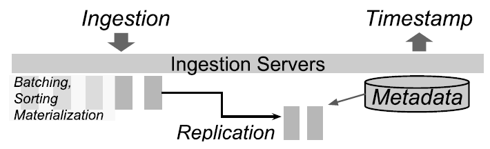

# Napa: Powering Scalable DataWarehousing with Robust Query Performance at Google

> 
Ankur Agiwal, Kevin Lai, Gokul Nath Babu Manoharan, Indrajit Roy, Jagan Sankaranarayanan, Hao Zhang, Tao Zou, Min Chen, Zongchang (Jim) Chen, Ming Dai, Thanh Do, Haoyu Gao, Haoyan Geng, Raman Grover, Bo Huang, Yanlai Huang, Zhi (Adam) Li, Jianyi Liang, Tao Lin, Li Liu, Yao Liu, Xi Mao, Yalan (Maya) Meng, Prashant Mishra, Jay Patel, Rajesh S. R., Vijayshankar Raman, Sourashis Roy, Mayank Singh Shishodia, Tianhang Sun, Ye (Justin) Tang, Junichi Tatemura, Sagar Trehan, Ramkumar Vadali, Prasanna Venkatasubramanian, Gensheng Zhang, Kefei Zhang, Yupu Zhang, Zeleng Zhuang, Goetz Graefe, Divyakant Agrawal, Jeff Naughton, Sujata Kosalge, Hakan Hacıgümüş
  
> 
Google Inc
  
> 
napa-paper@google.com
  

> This work is licensed under the Creative Commons BY-NC-ND 4.0 International License. Visit https://creativecommons.org/licenses/by-nc-nd/4.0/ to view a copy of this license. For any use beyond those covered by this license, obtain permission by emailing info@vldb.org. Copyright is held by the owner/author(s). Publication rights licensed to the VLDB Endowment.  
> Proceedings of the VLDB Endowment, Vol. 14, No. 12 ISSN 2150-8097.  
> doi:10.14778/3476311.3476377  
 
## 摘要
Google 服务不断生成大量应用程序数据。这些数据为业务用户提供了有价值的见解。我们需要在对可扩展性、亚秒级查询响应时间、可用性和强一致性等极其苛刻的要求下存储和服务这些行星级的数据集；所有这一切同时从全球使用的应用程序中获取大量更新。我们开发并在生产中部署了分析数据管理系统 Napa，以满足这些要求。 Napa 是 Google 众多客户的后端。这些客户对无差异、稳健的查询性能有着强烈的期望。 Napa 实现强大查询性能的主要技术的核心包括积极使用物化视图，随着跨多个数据中心摄取新数据，这些视图会得到一致维护。我们的客户还要求满足其独特需求的查询性能、数据新鲜度和成本。 强大的查询处理和客户端数据库的灵活配置是 Napa 设计的标志。
 
这方面的大部分相关工作都充分灵活设计整个系统，而无需支持各种预先存在的用例。相比之下，我们面临的一个特殊挑战是 Napa 需要处理来自现有应用程序和基础设施的硬约束，因此我们无法做到“绿色”。这些约束导致我们做出特定的设计决策并设计新技术来应对挑战。在本文中，我们分享了我们在生产环境中设计、实施、部署和运行 Napa 的经验，以及一些 Google 要求最苛刻的应用程序。

## 1 介绍
谷歌在全球拥有超过 10 亿用户提供多项服务。在提供这些服务时，Google 服务依靠应用程序数据来提供更好的用户体验、提高服务质量和进行计费。 Google 业务用户通过复杂的分析前端与这些数据进行交互，以深入了解他们的业务。这些前端对大量数据发出复杂的分析查询并施加严格的时间限制。在某些情况下，商定的查询响应时间目标是毫秒级的。这些数据有数 PB，并且通过大规模的行星级更新流不断更新。用户要求查询结果一致、新鲜，面对数据中心故障或网络分区时要求持续可用。本文介绍了 Napa，这是一种满足这些挑战性要求的分析数据存储系统。

在研究文献和行业中，OLAP（在线分析处理）和数据仓库的创新历史悠久。这项工作的大部分解决了特定的需求子集，例如可伸缩性或高查询性能，并且通常目标是在从头开始设计整个解决方案时找到最佳或有竞争力的解决方案。相比之下，在设计 Napa 时，我们必须解决一组全面的需求，而且我们没有从一个完全干净的状态开始的灵活性。

Napa 旨在取代早期的 Google 系统 Mesa [19, 20]。Napa已经运营多年了。继承了很多来自 Mesa 的数个PB的历史数据，并吸引了许多新客户。虽然 Mesa 是为满足特定的极端延迟要求而构建的，但 Napa 具有更广泛的任务。我们在相关工作部分比较了 Mesa 和 Napa； 简而言之，与 Mesa 相比，Napa 旨在在 Google 范围内使用，并满足许多分析应用程序的多样化需求。 Napa 的以下关键方面是其设计的基本原则，并符合我们的客户要求：
* [强大的查询性能] 一致的查询性能对数据分析用户至关重要。我们的客户期望低查询延迟，通常在几百毫秒左右，并且无论查询和数据摄取负载如何，延迟的差异都很小。尽管对规模和系统可用性提出了艰巨的要求，Napa 仍能够保证稳健的查询性能和一致的结果。
* [灵活性] 虽然性能很重要，但我们的经验表明，这并不是我们客户的唯一标准。例如，并不是所有的应用程序都需要毫秒级的响应时间，也不是所有的应用程序都需要相同的数据新鲜度，或者就此而言，并不是所有的客户都愿意为“不惜一切代价的性能”付费。客户还需要根据他们的动态需求灵活地更改系统。
* [高吞吐数据摄取] 所有的 Napa 功能，包括存储、物化视图维护和索引，都必须在海量更新负载下执行。 Napa 实现了一个基于 LSM-tree（Log-Structured Merge-Tree）范式 [25] 的分布式表和视图维护框架。 LSM 广泛用于当前一代的数据仓库和数据库，主要用于将数据嵌入到现有数据中。 Napa 扩展 LSM 以应对 Google 运营环境的挑战。

Napa 实现强大查询性能的方法包括积极使用物化视图，当跨多个数据中心摄取新数据时，这些视图会保持一致。这与通过电子扫描基础数据实现性能的其他系统的当前趋势形成对比。如果没有索引物化视图，为我们的大多数工作负载提供强大的亚秒级响应时间是极其困难的。查询工作负载的物化视图的覆盖范围决定了查询性能，而视图的刷新率则决定了新鲜度。结合起来，不同的视图覆盖了多少工作负载以及刷新它们的频率为客户提供了选择成本/性能权衡的杠杆
我们希望 Napa 的目标、我们面临的限制、我们做出的决定和我们开发的技术，将引起普遍的兴趣。
## 2 NAPA 的设计限制
Napa 为 Google 中的许多应用程序提供服务，这些应用程序对三个关键目标的要求不同：(1) 查询性能、(2) 数据新鲜度和 (3) 成本。当然，理想的情况是以尽可能低的成本实现最高的查询性能和最高的数据新鲜度。我们将交替使用查询性能和查询延迟，因为它们密切相关（高性能意味着低延迟）。数据新鲜度是通过将行添加到表中到可用于查询的时间之间的时间来衡量的。新鲜度要求从对新鲜度敏感的客户的几分钟到对成本敏感的客户的几个小时不等。成本主要是由于数据处理而产生的机器资源成本——摄取成本、后台维护操作和查询执行。通常，摄取和维护成本占主导地位。

在这三个目标中，查询性能还有其他挑战。客户端不仅关心低查询执行延迟；他们还关心可预测的查询性能，即查询延迟的低方差。例如，无论新数据到达的速度如何，外部 Google 报告仪表板都应继续以亚秒级延迟加载。换句话说，强大的查询性能与原始查询性能一样重要。此外，查询可能包含一个或多个表的连接，并且在使用 di 参数多次发出的意义上是重复的。

### 2.1 客户需要灵活性

Napa 的客户可以归类为在数据新鲜度、资源成本和查询性能之间进行三方面的权衡。一些客户需要高新鲜度，而另一些客户可能希望针对查询性能或成本进行优化。

一个重要的考虑因素是摄取和存储的耦合。这里的“摄取”是指呈现给 Napa 并开始将其合并到系统中的数据，而“存储”是指已应用于基表和所有物化视图的新数据，它可以将摄取与存储相结合，这意味着新的数据在完全处理之前不能被摄取。还可以将新数据与查询结合起来，这会降低查询性能。我们的客户不会接受这种情况，因为它们会导致以下不良效果
* [永远牺牲新鲜度] 如果摄取与存储紧密耦合，则摄取只能与存储带宽一样快。例如，这种系统中的更新只有在应用于表及其所有视图后才会提交。这种设计（由 Mesa 使用）有一个缺点，即添加到表中的附加视图会使摄取速度变慢。围绕这种设计选择构建的系统可能具有较高的查询性能，但会因摄取速度较慢而受到影响，并且可能被迫提供相对陈旧的数据。 
* [牺牲查询性能或一致性] 某些情况下可能采用视图生成作为查询的一部分进行，以便使用视图物化来加速后续查询（例如，database cracking [21] 和自适应合并 [17]）。也存在维护视图的异步延迟的模型（例如，[1]），但是这些系统在表和它们的视图之间没有一致性。这些方案对我们的客户用例没有太大帮助。使用此方案的概念 Napa 系统可能无法满足有关健壮和高查询性能的要求。

因此，Napa 需要为客户提供系统并满足他们在数据新鲜度、资源成本和查询性能方面的目标。

## 3 Napa的设计选择

Napa 必须具有高度可扩展性以处理更新流，同时以良好的性能服务数百万个查询。 Napa 的一个关键设计选择是依靠物化视图来实现可预测的高查询性能。

Napa 的高级架构由三个主要组件组成，如上图所示。
1. Napa 的摄取框架负责将更新提交到表中。这些更新在Napa中称为增量。摄取框架编写的增量仅用于满足摄取框架的持久性要求，因此是写入优化的。这些增量需要进一步整合，然后才能应用于表及其关联视图。
2. 存储框架以增量方式将更新应用于表及其视图。 Napa 表及其视图以增量方式维护，保存为LSM森林（log-structured merge-forests） [25]。因此，每个表都是更新的集合。增量不断合并形成更大的增量；我们称这个过程为“压缩”。视图维护层通过应用相应的 SQL 转换将表增量转换为视图增量。存储层还负责定期压缩表和视图。
3. 查询服务负责回应客户端查询。系统在查询时执行表（或视图）必要增量的合并。请注意，查询延迟是查询时合并功能的开销，因此存储子系统处理更新的速度越快，在查询时需要合并的增量就越少。 F1 Query [27] 用作存储在 Napa 中的数据的查询引擎。我们在第 8 节中提供了有关查询服务的更多详细信息。

Napa 将摄取与视图维护分离，并将视图维护与查询处理分离。这种解耦为客户提供了满足他们需求，允许在新鲜度、性能和成本之间进行调节。请注意，Napa 需要基表和视图的一致性，因此解耦是一种微妙但重要的设计选择，可确保 Napa 能够不断进步，而不管各个组件的性能如何。摄取仅取决于初始运行生成，即提交更新，而不取决于合并或视图维护。 Napa 还为客户提供高级选择，这些选择转化为选择性地索引数据并限制查询时的合并数量。

正如我们在下一节中讨论的那样，通过这些设计选择，Napa 客户可以选择“low effert”以优化成本，接受较低的查询性能。 “low effert” 意味着较少的压缩，以便在查询执行时付出较高的合并代价。类似地，low effert也可以表示较少的物化视图，或降低的新鲜度，同时在与视图匹配的查询上仍保持良好的查询性能。类似地，客户端也可以选择通过支付“更高的代价”来优化查询时性能，这表示较少的扇入（fan-in）合并，或者可以选择更有针对性的视图。

### 3.1 为客户提供灵活性
用户根据预期的查询性能、数据新鲜度和成本来指定他们的要求。这些要求被转换为数据库内部配置，例如视图数量、处理任务的配额限制、查询处理期间可以打开的最大增量数量等。这些配置在一个时间上，对应一个客户数据库。然而系统不是静态的，因为数据不断被摄取到表里，于是，需要一个动态但易于理解的数据库状态指标，该指标来自客户的需求对应的配置的上下文。

为此，Napa 引入了名为 Queryable Timestamp (QT) 的概念，为客户提供实时标记（就像推进的时间戳一样）。 QT 是新鲜度的直接指标，因为 [Now() - QT] 表示数据延迟。客户端可以查询到 QT 时间戳的所有数据。由于只有在增量数量达到上限且生成了所需数量的视图时才能推进 QT，因此可以保证用于提供查询的数据已满足提供预期查询性能的条件。此外，QT 的持续推进和保持在目标内的新鲜度表明系统能够在数据库中配置特定的成本约束范围对表和视图应用更新。我们将在第 6 节中更详细地讨论 QT 概念。

我们说明了三类 Napa 客户端以及系统如何使用 QT 推进标准来调整 Napa：
* [牺牲新鲜度] Napa 有一个注重成本的客户端，它运行着一个谷歌范围内的内部实验分析框架。对于此客户端，良好的查询性能和适中的成本很重要，即使系统需要较低的数据新鲜度。对于这个客户，Napa 的 QT 提升的关键在于查询执行时保持适度数量的视图和更少的增量合并。为了保持低的成本，Napa 的执行框架使用更少的工作任务和更便宜的空闲机器资源来进行视图维护。因此，即使视图维护速度慢了，并因此使数据新鲜度受到影响，Napa 也能以适中的资源成本为该客户端提供了良好的查询性能。
* [牺牲查询性能] 一些 Napa 客户需要新鲜的答案，但查询性能要求较低或中等。对于这些客户端，QT 推进关键在于产生较少的视图，但在查询执行时可能需要合并的增量相对较多。由于每个表和视图的增量较多，因此查询性能较低。查询服务框架花费更多I/O 时间和合并更多行，否则需要在视图维护和压缩期间做这些。 因为视图维护的开销比较低，Napa 的执行框架分配更多的worker进行摄取而不是视图维护。查询性能可以获得更好的新鲜度和更低的资源成本。
* [牺牲成本] Napa 有一个为 Google 外部仪表板提供支持的客户端。对于这个客户来说，良好的查询性能和数据新鲜度是最重要的，哪怕成本更高。对于此类客户，Napa 的 QT 推进标准取决于众多视图（有时单个表为 100 个），并且合并时的增量数量非常低，以确保更短的查询执行时间。 Napa 使用大量工作任务来确保可以通过更快的摄取和高吞吐量的视图维护来快速满足此 QT 标准。此 QT 推进标准为客户端提供了所需的查询性能和数据新鲜度，但是资源成本相对较高。

类似的不同种类的客户需求是系统配置的一部分，Napa 使用这些配置作为指导来提供指定的查询性能、数据新鲜度和资源成本。

### 3.2 数据可用性
在过去十年中，Google 内部的大多数服务都经过精心设计，可以承受可能由灾难性故障或定期维护导致的数据中心规模中断。包括 Napa 在内的 Google 服务可确保系统在出现此类中断的情况下仍可正常运行。提供这种级别的容错的底层范例是在多个数据中心复制客户数据库并确保数据库副本相互一致。一种直接的方法是使用全局一致的事务系统（例如 Google 的 Spanner [7]）将 Napa 摄取活动作为同步事务执行。相反，Napa 使用了一种方法，将执行数据操作和元数据操作解耦，以便在数据中心的每个副本上异步执行数据操作，并定期使用元数据操作以确保副本彼此保持同步。特别是相对不频繁的元数据操作使用 Spanner 来保证所有副本的相互一致性。这种高度分布式机器的同步和异步模式的编排是Napa的一项关键创新。可查询时间戳表示数据库中的所有表和视图在所有数据中心中全局一致的状态。即使在每个副本上异步执行压缩和视图维护，系统也会从一个一致状态移动到另一个一致状态。

## 4 系统架构
Napa 的高级架构由数据和控制平面组成，如图 3 所示。该架构部署在多个数据中心，以管理每个数据中心的副本。数据平面由摄取、存储和查询服务组成。控制平面由一个控制器组成，该控制器协调各个子系统之间的工作。控制器还负责跨多个数据中心同步和协调元数据事务。 Napa 客户端创建数据库和表以及它们的关联模式。客户端可以选择为每个表创建物化视图。

Napa 是通过利用现有的 Google 基础架构组件构建的，这降低了整体开发成本，但也带来了挑战，因为我们已经做出了一些设计选择。例如，Napa 是建立在 Google 的 Colossus 文件系统 [12, 14] 之上的，具有分类存储基础设施。因此，Napa 中的表是需要有严格事务语义的功能集，例如元数据管理和存储系统状态。 Napa 使用 F1 Query [27] 进行查询服务和大规模数据处理，例如视图创建和维护。 F1 Query 是 Google 内部一个突出的符合 SQL 的查询处理系统，用作存储在 Napa 中的数据的查询引擎。 F1 Query 支持流式处理和批处理，这意味着同一系统可用于交互式查找查询以及处理大量数据的查询。请注意，不使用现有 Google 基础架构的替代方法是自行开发这些基础架构， 这在工程成本方面是令人望而却步的，更不用说是重复造轮子。
 
Napa 客户端使用 ETL 管道将数据插入到他们的表中。摄取框架可以承受非常高的负载，例如数十 GB/s 的压缩数据。客户端数据被传送到任何 Napa 副本，Napa 确保在所有数据中心合并数据摄取。这明显简化了摄取管道的设计。

Napa 擅长为客户提交的复杂聚合查询的工作负载提供服务，因此，存储和视图维护框架是 Napa 维护这些聚合的关键组件。存储框架负责压缩表和增量更新视图。压缩需要合并增量创建更大的增量，通常具有高扇入，这减少了在线查询期间的合并操作。这类似于 LSM 树中的后处理，将在线查询的I/O开销转移到离线处理的I/O上面。

查询服务在运行时处理必要的缓存、预取和合并增量。查询服务的目标是提供具有低延迟和低差异性的查询。低延迟是通过将查询定向到预先计算的物化视图而不是基表和并行执行查询来实现的。低差异性是通过控制合并的扇入（fan-in）以及一系列其他降低I/O和尾部容差（tail tolerance）技术来实现的。 

Napa 依赖视图作为获得良好查询性能的主要机制。Napa的表，包括物化视图，通过它们的（多字段）主键进行排序、索引和范围分区。鉴于数据库社区最近倾向于基于扫描的查询处理，这可能是一个令人惊讶的设计选择。 Napa 的选择很大程度上受到其工作负载的严格延迟和资源要求的推动，因此有必要利用索引键查找。 大多数 Napa 查询都可以通过范围分区索引表来回答。请注意，范围分区会带来一系列问题，例如由于临时键而导致的热点和负载平衡。对于这种情况，其他分区方案也在研究中，但这些超出了本文的范围。 LSM 和大规模索引的结果意味着效率上 Napa 严重依赖于合并和排序性能，相当大的开销花费在加速排序、合并和分组的算子上面。

Napa 控制器调度压缩和视图更新任务，用以将表的增量数保持到可配置的值。考虑到成本，需要这些存储任务来保持可查询时间戳 (QT) 尽可能新鲜。数据库新鲜度依赖于数据库的QT，被查询系统用来提供如前所述的健壮查询性能。 Napa 支持几个小时的近实时的数据库新鲜度；大多数客户要求他们的数据库达到大约数十分钟的新鲜度。如果新鲜度超出预期范围，系统将继续为客户查询提供服务。但是，与所要求的的新鲜度相比，在这种情况下提供的数据将是陈旧的，并且可能需要通过暂时允许更高成本来调整交易等管理措施来将新鲜度恢复到范围内。 Napa 拥有数百个数据库，其中包含数百到数千个表和视图，每个表和视图都具有稳定的摄取率。然而， 该系统能够将所有这些数据库保持在所需的新鲜度，这证明了我们设计的稳健性。
 
## 5 摄取数万亿行
摄取框架的目标是允许摄取管道将大量数据插入 Napa，且不需要明显的开销。回想一下，Napa 的一项关键技术是将摄取与视图维护和索引分离，以便为客户提供新鲜度、查询性能和成本之间的交易。如图 4 所示，摄取框架通过两种机制促成了这种设计。首先，摄取框架的目标是接受数据、执行最少的处理并使其持久化，而无需考虑后续视图维护的速度。所有摄取的行都被分配一个元数据时间戳以进行排序，然后在满足其他持久性条件（例如多副本）后标记为已提交。其次，摄取框架提供了调节来限制机器成本峰值，方法是允许配置来增加或减少任务数，这些任务接受数据并执行批处理、聚合和复制的批处理。

客户端将要摄取的数据交付给任何一个 Napa 副本，Napa 有责任确保在所有副本中摄取数据以确保可用性。摄取框架产生写入优化的增量，因为它们很小，并且它们的物理大小受到服务器内存容量的限制。这些 deltas 不能立即用于查询，因为这些 deltas 有很多，这将减慢查询服务，所以它必须合并它们。我们将这些增量称为不可查询，并要求在查询它们之前对其进行压缩。

## 6 可查询时间戳
表的可查询时间戳（QT）是一个时间戳，它表示可以查询的数据的新鲜度。如果 QT(table) = X，则客户端可以查询到时间 X 之前的所有数据，并且时间 X 之后的数据不属于查询结果的一部分。换句话说，一个表的新鲜度是 [Now() - QT]。 QT 充当屏障，使得在 X 之后摄取的任何数据都对客户端查询隐藏。一旦在 (Y-X) 范围内摄取的数据经过优化以满足查询性能要求，QT 的值将从 X 前进到 Y。反过来，客户可以使用 Napa 的配置来调整新鲜度、查询性能和成本。例如，如果客户想要高查询性能和低成本，但可以换取新鲜度，则系统优先使用较少的机器资源进行视图维护以降低成本，QT可能进展缓慢，从而表明数据新鲜度降低。

确保良好查询性能的一个重要标准是优化读取的基础数据并确保视图可用以加快查询速度。Napa的一张表由它的一组 delta 文件组成，如图 5 所示，每个 delta 对应于在一个时间窗口内接收到的表更新。不可查询的 delta 对应于最近时间窗口中摄取框架写入的新接收的更新（通常是几秒钟）。另一方面，最大的增量跨越数周甚至数月的时间窗口。每个 delta 都按其键排序、范围分区，并具有类似本地 B 树的索引。这些增量在查询时根据需要合并。虽然 Napa 是一个列存储，但它必须管理维护表视图和实现快速查找的双重问题。我们在物理设计中借鉴了行存储（例如 B-trees 和 PAX [2] 布局）的想法，以实现这些看似完全不同的目标。

大多数客户端查询都有严格的延迟限制，这对在查询执行期间应该打开和合并的最大数量（例如 x）设置了硬限制。特别是，可查询时间戳（QT）是形成 x 边界的增量，从最旧的增量向最新的增量计数。通常，这个限制是几十个增量，并且自动取决于对数据库的查询性能要求。自动化模块会根据查询工作负载动态调整此限制；查询工作量大、查询性能要求高的表有较低的限制，而查询要求不高的表有较高的限制。可以支持多大的数字 x 存在一些实际限制。随着这个数字变大，查询开始受到拖尾效应（tail effects）的影响。鉴于查询时间合并非常昂贵，通过保持给定数据库的增量数量稳定性， Napa 能够提供强大的查询性能，即有力地保证查询延迟的变化很低。

QT 本质上依赖于后台操作的进度，例如压缩和增量视图维护。数据库的 QT 是数据库中所有表的 QT 的最小值。 QT 还用于为客户提供跨所有 Napa 副本的一致数据视图。每个副本都有一个本地值 QT，它基于本地副本中数据的新鲜程度。 QT 的全局值是根据查询服务可用性要求从本地 QT 值计算出来的。例如，如果我们有 5 个本地 QT 值为 100、90、83、75、64 的 Napa 副本，并且查询服务需要大多数副本可用，则所有站点的新 QT 设置为 83，因为大多数的副本至少更新到 83。Napa 将使用 QT 至少为 83 的副本来回答查询，因为保证对这些副本的查询只需要读取本地可用的增量。
 
## 7 大规模维护视图

Napa 的存储子系统负责维护视图和压缩增量。它还负责通过跨数据中心的复制来确保数据完整性和持久性，并负责处理从单个机器到整个数据中心的中断。

在构建 Napa 时，我们的目标是确保存储子系统达到 PB 级规模，即使在存在数据倾斜的情况下也是如此。虽然 Napa 支持连接多个表的物化视图，但在下文中，我们将讨论单个表上的视图所面临的挑战。视图维护中的偏差发生在将基表上的更新转换为视图上的更新的过程中。基表键空间到视图键空间的映射可能会导致不连续，其中大多数基表更新可能映射到狭窄的视图键范围，从而导致偏差。由于数据库的 QT 由最慢的视图或表决定，因此系统必须自动调整大小变化和上述数据倾斜，以确保 QT 不受落后视图或表的影响。存储子系统还通过改变视图数量、任务和使用的机器资源类型来调整成本预算。特别是， 视图维护框架的关键方面包括以下内容：
* [使用 F1 Query 作为“数据泵”] Napa 的设计选择是使用 Google 的 F1 Query [27] 作为关系数据泵来压缩表和维护视图。视图维护使用查询优化器，它可以在备选计划中做出很好的选择，如下面的第 7.1 节所示。
* [重新计划以避免数据倾斜] 如果系统检测到数据倾斜，系统可以在 y 上重新计划。例如，Napa 中许多表的第一个键是具有几个不同值的日期列。尽管基表可能有数百个键列，但大多数键列大多为零或与另一个键有很强的相关性。在我们的规模上，未能检测到偏差意味着视图维护查询可能永远不会出现无限的新鲜度延迟。这是使用 F1 Query 作为数据泵的直接好处。
* [循环中的智能] 只有当所有表和视图都赶上时，数据库才能推进 QT。这意味着 QT 被最慢的视图阻挡，需要相当复杂的落后节点的迁移处理。 Napa 控制器实现了智能进行尾部节点的迁移。这里的主要技术是根据历史负载选择数据中心执行任务，根据进度主动终止任务，并发任务执行以限制尾部的大小。
 
### 7.1 View Maintenance 中的查询优化挑战
    Napa 的视图维护过程与输入相关联。视图更新查询必须解决独特的优化挑战，因为处理的数据量很大，或者特定的数据属性（数据基数 cardinality, 稀疏性 sparseness, 相关性 correlations），这些导致大规模查询处理的复杂化。大量数据意味着必须小心不要破坏难以重新创建的排序和分区等有益数据属性。

数据属性的一个具体示例是要更新的视图相对于基表的排序顺序。一种方法是基于视图排序顺序对视图键重新排序，而不管基表排序顺序如何。鉴于我们的规模，这将是一个昂贵的处理方案。相反，尽可能保持输入排序是有益的。即使视图的排序顺序和基表的排序顺序仅部分重叠，也可以利用排序性。同样，更改数据分区属性需要通过网络移动数据，这通常也会破坏排序，除非绝对必要，否则应避免。这些想法并不是新的，而是数据库文献 [28] 中“有趣的排序”的扩展，这是我们使用符合 SQL 的数据处理系统（即 F1 Query）作为关系型的泵来维护视图的动机。从广义上讲，根据维护它们的成本，共有三类视图，如图 6 所示。

* 在我们的框架中维护的最便宜的视图是那些与基表共享前缀（prefix）的视图。一个具有键（A，B，C）的基表，而视图位于（A，B）上的视图。在这种情况下，框架通过基于公共前缀对输入进行聚集并以流式方式聚合，完全地避免了排序。
* 第二类视图是那些与基表有部分前缀但不是完整前缀的视图。例如，基表具有 (A, B, C, D) 而视图位于 (A, B, D) 上。即使在这种情况下，我们也可以通过在 (A,B) 上对输入基表进行聚类，然后在 D 上对每个唯一的 (A,B) 组进行排序来利用输入排序顺序。请注意，此处和上述示例中的部分前缀聚类可能会导致偏斜，需要对其进行检测和纠正。
* 第三类视图是基表和视图不共享任何前缀的视图。例如，基表是（A，B，C，D），而视图是（D，C，A）。优化的机会很少，而且这些视图在实践中是最昂贵的，因为它们需要重新分区和重新排序。

与基表相比，某些视图具有很高的聚合收敛（甚至 100-1000 倍），因此与原始表更新相比，视图更新很小。也有与基表大小几乎相同的视图。对于具有高基数收敛的视图，保留排序顺序并不是最重要的，因为输出足够小，以至于可以完全专注于减少基数并在需要时重新排序输出。另一方面，对于视图聚合度较低的情况，即视图与基表的大小相似，排序和合并变得很重要。于是，我们花费了相当大的工程量为Napa开发一个 state-of-the-art 的排序库。对数据进行排序的所有 Napa 组件（从摄取服务器到 F1 Query 中的排序运算符）都使用相同的库。我们的排序和合并库中的主要技术来自于先前的文献（例如，[15,22,23]）：normalized keys for efficient comparisons, poor man’s normalized keys [15] for cache efficiency, tree-of-losers priority queues [23] for a minimal comparison count, and offset-value coding [22] for caching partial comparisons。关键成就是实现了这些已知技术、调整算法并部署库以进行 Google 规模的处理。

### 7.2 压缩机制
压缩将多个输入增量组合成一个输出增量。压缩通过 1) 将输入排序在一起和 2) 将多个更新聚合到同一行来提高查询性能并减少存储消耗。与查询相关的异步压缩既减少了查询时的合并工作，又在多个查询中利用了压缩结果。然而，对于高摄取率的表，压缩是昂贵的，并且它们通过延迟数据变得可查询来降低数据新鲜度。如前所述，通过客户端的配置来调节这些。例如，优化查询性能的配置会导致频繁压缩，使得在查询时合并的最大 delta 数小于 10，但这样的配置明显的造成摄取的延迟和压缩成本很高。

由于增量文件是单独排序的，因此压缩本质上是合并排序。与客户端查询不同，在客户端查询中，合并的扇入保持较小且有界以避免尾部效应，在压缩期间则故意保持的较大，从而使合并树的高度很小，从而最大限度地减少键比较。压缩查询最多一千个输入的扇入，超过这些输入，合并性能会下降。合并过程划分来自各种输入的固定内存预算。在大约一千个输入时，每个输入流的内存很小。除此之外，当其中一个输入被消费完时，合并过程将停止。在 1000 路合并时，这种情况的发生频率是 10 路合并时的 100 倍。这两个影响的组合使大型合并方式无法执行，这可以通过 I/O 预取来解决。

## 8 强大的查询服务性能 
对于许多 Napa 客户来说，在毫秒级内获取查询结果是其业务用例的关键要求。严格的延迟要求适用于尾部情况（例如第 99 个百分位）、对 PB 大小的表的范围查找，甚至当底层共享基础设施的性能和可用性波动时。本节描述了查询服务子系统如何使用可查询时间戳 (QT)、物化视图和一系列其他技术实现强大的性能。

### 8.1	减少关键路径中的数据 
Napa 使用多种技术来减少读取数据量以回答关键路径上的查询。只要有可能，Napa使用视图而不是基表来回应查询，因为具有聚合函数的视图可能具有更少的数据。当 F1 工作人员从 Delta 服务器读取数据时（如图 7 所示），过滤器和部分聚合被下推，以最大限度地减少通过网络传输到 F1 工作人员的字节量。这一点至关重要，因为 F1 Query 工作人员和 Napa 存储并不总是位于同一个数据中心，而且跨数据中心网络传输的延迟差异往往比数据中心内传输更大。 Napa 还依靠并行性来减少每个子查询必须读取的数据量。 Napa 在其存储的数据上维护稀疏的 B 树索引，并使用它们将输入查询快速划分为满足分区机制的数千个子查询；另外还兼顾延迟任务分配和查询服务资源的可用性，以实现良好的性能。

### 8.2 最小化顺序 I/O 的数量
鉴于 Google 规模的数据集，以及我们对共享和分解存储的依赖，如果元数据（例如，数据统计信息、视图和元数据）必须从磁盘甚至 SSD 读取，通常会遇到高延迟。发出查询时，Napa使用 QT 的值来决定要处理的元数据的版本。元数据反过来决定了必须处理哪些数据。因此，元数据读取是查询服务的关键路径。Napa 确保所有元数据始终可以从内存中读取，不需要读取持久存储。这是通过基于亲和力分布式元数据缓存实现，后台会定时进行刷新。特定的 QT 被延迟以等待元数据的周期性后台刷新完成。

所有数据读取都通过一个透明的分布式数据缓存层，基于该层进行文件 I/O 操作。分布式缓存可进行穿透读取，同一数据的并发读取未命中时，可以共享的对应的读取。共享读取对于分布式缓存至关重要：多个 Delta 服务器在处理同一查询的两个子查询时通常需要读取重叠范围的索引文件，而分布式数据缓存确保此类读取只处理一次。

分布式缓存层能明显减少I/O，却无法消除它们，因为 Napa 查询服务的总工作集大小显著大于可用的聚合缓存内存。因此，Napa 执行离线和在线预取以进一步减少关键路径中的顺序 I/O 数量。在 QT 推进以使新数据可用于查询之前，一旦为频繁查询的表摄取了数据，就会发生离线预取。在线预取在查询到达时开始，由影子查询执行器执行，影子查询执行器与主查询执行器共享数据访问模式，但会跳过所有查询处理步骤。由于影子查询执行器跳过处理，它运行在主查询执行器之前，基于过去的访问，取得比预读磁盘更好的预取效果。

### 8.3	合并小的I/O
在查询服务期间，Napa 通过将查询划分为细粒度单元，然后跨增量和跨查询列并行化 I/O 调用，积极地并行化工作。然而，并行化有其自身的成本，尤其是在尾部延迟方面。假设每个 Napa 查询向磁盘发出 1000 个并行 I/O。 Napa 的 90分位的延迟受到底层磁盘存储的 99.99分位的延迟，这通常远高于其 90分位、99分位和 99.9分位 的延迟。为了克服这种尾部效应，Napa使用QT限制可查询的增量的数量。此外，Napa 还尝试通过使以下两种技术尽可能地合并小的 I/O：跨 deltas 的延迟合并和基于大小的磁盘布局。
* [跨增量延迟合并] 在一个简单的查询计划中，Napa 将自己作为具有主键的数据源暴露给查询优化器。每个 Delta Server 在处理子查询时，必须先基于完整主键合并所有增量中的行。当有数千 (N) 个子查询和数十 (M) 个 delta 时，并行 I/O 的数量在数万 (N x M）。但是，由于并行性，每个子查询从大多数增量中读取的数据非常少。同时，很大一部分 Napa 查询需要在查询计划的后续阶段基于主键子集进行合并。在这些情况下，Napa 会调整查询计划以避免 Delta Server 中的交叉 delta 合并，并让每个 Delta Server 只处理一个 delta，将 N M 个并行 I/O 组合成接近 N 个并行 I/O。
* [基于大小的磁盘布局] Napa 使用定制的列式存储格式，支持多个磁盘布局选项，这些选项基于增量大小应用。 PAX 布局 [2] 可以将所有列访问组合到一个 I/O 中以进行查找查询，适用于小增量。对于较大的增量，使用逐列布局，即 I/O e 查找查询。这种基于大小的选择可确保 Napa 获得列式存储优势并减少 I/O 操作。

### 8.4 容忍尾部延迟和失败
Napa 建立在 Google 基础架构上，由于其共享性质，很容易出现性能和可用性波动，尤其是在尾部。 Napa 采用容忍尾部延迟的原则，而不是消除它，因为消除这种复杂且相互依赖的系统的所有可变性来源是不可行的 [9]。对于非流式 RPC，比如 Metadata Server 和 Delta Server 之间的 RPC，Napa 采用了套期保值的机制，即在一定延迟后将与原来相同的 RPC 再次发送到不同服务器，等待更快的回复。对于流式 RPC，例如 F1 worker 和 Delta Server 之间的 RPC，Napa 会估计其预期的进度速率，并要求执行它的服务器定期报告进度，以及一个延续令牌。如果报告的进度低于预期或报告丢失，最后一个连续令牌负责在其它服务器上重启新的流式 RPC，而不会丢失进度。像过滤和部分聚合这样的下推算子需要在进度报告中小心处理，因为它们可以显着减小数据大小，同时也导致进度报告超低甚至丢失。 Napa 使用过滤和部分聚合之前处理的字节数作为进度率指标，并定期强制这些worker启动其内部状态以生成带有延续令牌的进度报告。

对于影响查询服务但不影响摄取的数据中心层的问题，上述尾部容忍机制将启动并自动将查询重新路由到相邻数据中心的服务器。当摄取受到影响时，数据中心本地 QT 会根据本地 QT 延迟值路由到其他数据中心。

 查询延迟随着视图数量的增加而减少，(b) 允许查询跨越的增量数量以及相应的延迟影响（越低越好）")

## 9 生产指标洞察
Napa 管理着生产环境中的数千个表和视图，其中许多表是 PB 级的。它每天处理超过 10 亿次查询并摄取数万亿行。在本节中，我们将讨论 Napa 如何通过三种技术提供稳健的查询性能：（1）通过更积极地使用视图，Napa 降低了原始查询性能和差异性，即使在第 99 个百分位，（2）通过更改存储策略，Napa 可以降低增量的数量以及尾部延迟，以及 (3) 通过解耦摄取、视图维护和查询执行； Napa 可以降低基础架构和工作负载的变化对查询性能的影响。我们还讲述了三个不同负载特性的生产客户端：数据新鲜度、查询性能和成本要求。本节中的所有数据均来自实际生产数据。我们已经对下图 Y 轴上的单位进行了标准化，以保持我们业务数据的机密性。 请注意，我们选择显示的结果，对于图表中各种曲线的相对改进比它们的绝对值更重要。

### 9.1	视图和 QT 有助于实现强大的查询性能

首先，大多数客户端查询是聚合查询，物化视图通常至少比派生它们的基表小一个数量级。从视图中读取不仅提高了原始性能，而且还改善了尾部延迟，因为它们的较小尺寸对缓存更友好，并且需要更少的计算资源，从而减少了查询资源争用的机会。图 8(a) 是一个示例，比较了对于不同数量的视图，客户端查询延迟的百分率。对于特定的工作负载，通过仅添加两个视图，客户端可以将其平均和90分位的查询性能提高 1.5 倍。最深远的影响是 99分位的查询延迟，随着我们添加多达 8 个视图，它会不断改进。超过 8 个视图后，查询性能达到稳定水平，因为大多数查询现在能够使用视图而不是基表。

其次，可以通过在查询时减少必须要打开、读取和合并的增量数量来改善延迟。图 8(b) 显示，当我们更改存储策略以减少增量数量时，查询延迟明显改善。对于此工作负载，在第 8.3 节中描述的跨增量延迟合并优化无法使用，因为查询中没有后续聚合，因此限制增量的数量至关重要。最大的影响是在99分位的延迟，随着增量的数量从 8 变为 2，延迟减少了 3.6 倍以上。主要原因是：(1) 较少的增量意味着较少的小型并行 IO 数量，它容易导致延迟尾部，（2）更少的增量也意味着数据是预先合并和聚合的，并且在查询时需要更少的处理。

### 9.2 处理基础设施问题
图 9 显示，即使在摄取负载发生变化或基础设施中断时，Napa 也能够保证其客户端稳定的查询性能。图 9 显示了客户端在几个小时内的工作负载。 Napa 将摄取与视图维护和查询分离，这使我们能够优化查询延迟的差异性，即在某些情况下调整数据新鲜度。图 9(a) 显示客户端连续向 Napa 发送数据，在一周的过程中输入速率存在一些差异。图 9(b) 显示视图维护性能在 X 和 Y 之间的时间内下降，这表明存在基础设施问题，影响了视图更新的任务。然而在此期间查询服务延迟却保持接近恒定（图 9(d)）。在这个特定示例中，客户端查询继续快速，但是，对于中断期间的某些部分，数据新鲜度受到影响，如图 9(c) 所示，其中延迟值很高。

### 9.3 客户端工作负载

 摄取负载，(b) 数据延迟，(c) 查询延迟，(d) 每个摄取单元的资源成本")

图 10(a)-(d) 显示了 Napa 如何为客户提供不同性能和成本指标下的优化。这些生产客户有如下所述的需求。 
* [客户 A：新鲜度的权衡] 它是一个内部实验和分析应用程序，它需要中等查询性能和低成本，但可以容忍较低的新鲜度。它已将 Napa 调整为具有中等数量的视图，并实现了相当好的查询性能。鉴于它具有最高的摄取率，它会牺牲数据新鲜度以保持成本适中。
* [客户端 B：查询性能的权衡] 它是一个最关心成本但可以容忍较低查询性能的应用程序。该客户端使用 Napa 的方式减少了用于优化客户端查询数据的费用。因此，该客户端的资源成本最低（图 10(d)），尽管它的摄取率高于客户端 C。
* [客户 C：成本的权衡] 它是一个关键的面向外部用户的应用程序，具有高新鲜度和高查询性能要求，并且愿意为实现这些要求付出高昂的代价。此客户端已将 Napa 调整为拥有大量视图，并使用频繁的压缩来保持较低的增量数量。结果，该客户端具有更好的数据新鲜度（图 10（b））和查询性能（与客户端 A 和 B 相比），但即使其摄取率低于其他两个，也必须支付增加的资源成本（图 10(c)）。

## 10 相关工作
有许多商业服务，例如来自 Teradata、甲骨文、IBM、微软、Snow Amazon 和许多其他公司。这些商业系统的技术进步包括列式存储、查询优化以及针对写入和更新优化索引的多种设计。

* Cloud Offerings。传统的数据分析系统已经从存储和计算的紧密耦合发展为存储和计算解耦的分解模型，以利用云计算范式。 Amazon Aurora [30] 将事务和查询处理层与存储层分离。Redshift [18] 支持非持续维护的物化视图；Snowflake项目，作为“虚拟数据仓库”，它可以按需启动然后关闭，它提供了现代数据库创新，例如列式存储、向量化和查询优化中的匹配变化。 Napa 提供持续摄取和高性能查询以及可调新鲜度。它通过解耦其架构组件进一步推进了分解的想法：摄取、聚合（即，在物化视图中派生更新）、索引和查询。因此，索引速度对查询性能的影响可以通过交易数据新鲜度或产生更高的成本来最小化，如第 9 节所示。这种改进是通过引入新鲜度的概念作为另一个可调参数来实现的Napa的这种独特的能力。

* Google 内部的数据分析。在 Google 构建大规模数据管理系统的早期尝试是 Tenzing [6]，它提供基于Map-Recude [12, 14] 和 Bigtable [4]的SQL能力。 Dremel [24] 是一个基于扫描的查询系统，可以使用数千台机器对 Google 的日志数据进行大规模查询。 Procella [5] 是最近基于扫描的系统，它通过使用先进的存储格式改进了 Dremel，支持过滤表达式（filter expressions）, zone maps, bitmaps, bloom filters, 以及基于key的分区和排序（partitions and sorting by keys）。与这些先前的系统相比，Napa 是一个完全索引的系统，针对键查找、范围扫描以及高效的表和视图增量进行了优化。 Napa 可以轻松地支持即席查询和选择性高且多样化低的查询（点查或多点查？）。早期系统使用分片的MySQL，随着时间的推移分成两个系统，数据层使用Mesa，查询层成了F1 Query [27, 29]。

* 与 Mesa 比较。Napa旨在成为 Mesa 的直接替代品，因此是一个多租户、多宿主、分布式、全球复制的数据管理系统，供 Google 内的关键任务应用程序使用。 Napa 在数据库方面引进了最先进的技术，以满足终端用户的新鲜度、成本和查询性能权衡具有出色的一致性语义，因为它提供了单个数据库级可查询时间戳，这意味着用户可以以一致的方式引用和查询多个表和视图。 Napa 还支持具有完整具备SQL通用性的视图，其中一部分可以持续维护。 Mesa 使用自定义框架来创建和维护物化视图及其索引。相比之下，Napa 使用 SQL 引擎 F1 Query 来处理用户查询和维护表、物化视图和索引。 Napa 在查询延迟和运行系统的成本方面比 Mesa 有了显着的改进。

* 基于 LSM 的索引系统。 B 树 [3, 16] 是许多传统数据库管理系统中的主要索引结构。 Napa 使用 B+-trees 的一种变体，该变体利用了 Napa 表具有多部分键的事实。此外，最小/最大键（每列最小/最大值）与每个非叶块一起存储，进行有效的裁剪。LSM-trees配合树索引能够适应高更新率。 Napa 属于一类 LSM 系统，它以高写入吞吐量换取快速读取。写入被写入层级文件，这些文件被压缩以形成更大的层级文件。读操作会在运行时合并这些文件。LSM 数据结构的效率，通过“将输入行写入磁盘的次数（跨所有层级）的写入幅度来衡量。由于合并是一个顺序过程，因此我们也使用更多顺序 I/O，而不是发出随机 I/O。基于 LevelDB [13] 的 RocksDB [11] 和 PebblesDB [26] 是使用 LSM 方案的写入密集型键值存储的示例。

## 11 结论
Napa 是一个分析数据管理系统，为关键的 Google 仪表板、应用程序和内部用户提供服务。在某些方面，它可以与其他相关系统相媲美：高可扩展性、通过复制和故障转移实现的可用性、高用户查询负载和大数据量。在其他方面，它有一个有可能是独特的特征组合：依靠物化视图确保大多数查询是亚秒级的查找，在摄取数万亿行的同时维护视图，并为客户提供灵活性来平衡数据新鲜度、查询延迟和成本。

当前的数据管理存储系统通常依赖于列存储、并行和压缩加速的扫描，而 Napa 则严重依赖视图来保证强大的查询性能。使用对LSM-forests实现连续的高带宽插入，以优化视图。 Napa 为客户提供查询性能、新鲜度和成本的配置参数。 Queryable Timestamp (QT) 根据上述要求提供了客户数据库生产性能的实时指标。 Napa 的可配置性意味着不同配置下的同一系统可以服务于注重成本、及对高性能和新鲜度的需求的客户。

尽管 Napa 为 Google 服务得很好，但它在自动建议视图、使调整自驱动和支持新兴应用程序等方面继续发展。随着新的应用程序和用户频繁地添加到 Napa 生态系统中，新的挑战不断出现。

## 致谢
Napa 是前任和现任团队成员的成果。我们感谢 F1 Query 和 EngProd 团队，以及以下人员对 Napa 的巨大贡献：Alejandro Estrella Balderrama、Pablo Boserman、Dennis Frostlander、A Halumi、Taihua He、Mingsheng Hong、Rohit Khare、Sugeeti Kochhar、Ioannis Koltsidas , Lina Kulakova, Romit Kusarye, Andrew Lamb, Ruocheng Li, Sandeep Mariserla, Je Shute, Zhaozhe Song, Dao Tao, Dexin Wang, Chad Whipkey, Adam Xu, Yin Ye, Lingyi You, David Zhou, Ed Zhou 和 Min Zhou。我们也感谢 Ashish Gupta 和 Shiv Venkataraman 为 Napa 团队提供战略愿景和指导。
 
## 参考文献
* [1] P. Agrawal, A. Silberstein, B. F. Cooper, U. Srivastava, and R. Ramakrishnan. 2009. Asynchronous view maintenance for VLSD databases. In SIGMOD. Providence, RI, 179–192. 
* [2] A. Ailamaki, D. J. DeWitt, and M. D. Hill. 2002. Data page layouts for relational databases on deep memory hierarchies. VLDBJ 11, 3 (2002), 198–215. 
* [3] R. Bayer and E. M. Mccreight. 1972. Organization and Maintenance of Large Ordered Indexes. In Software Pioneers. Vol. 1. Springer-Verlag, Berlin, Heidelberg, 173––189. 
* [4] F. Chang, J. Dean, S. Ghemawat, W. C. Hsieh, D. A. Wallach, M. Burrows, T. Chandra, A. Fikes, and R. E. Gruber. 2008. Bigtable: A Distributed Storage System for Structured Data. ACM Trans. Comput. Syst. 26, 2 (2008), 4:1–4:26. 
* [5] B. Chattopadhyay, P. Dutta,W. Liu, O. Tinn, A. McCormick, A. Mokashi, P. Harvey, H. Gonzalez, D. Lomax, S. Mittal, R. Ebenstein, N. Mikhaylin, H.-C. Lee, X. Zhao, T. Xu, L. Perez, F. Shahmohammadi, T. Bui, N. Mckay, S. Aya, V. Lychagina, and B. Elliott. 2019. Procella: Unifying serving and analytical data at YouTube. PVLDB 12, 12 (2019), 2022–2034. 
* [6] B. Chattopadhyay, L. Lin, W. Liu, S. Mittal, P. Aragonda, V. Lychagina, Y. Kwon, and M. Wong. 2011. Tenzing: A SQL Implementation On The MapReduce Framework. PVLDB 4, 12 (2011), 1318–1327. 
* [7] J. C. Corbett, J. Dean, M. Epstein, A. Fikes, C. Frost, J. J. Furman, S. Ghemawat, A. Gubarev, C. Heiser, P. Hochschild, W. C. Hsieh, S. Kanthak, E. Kogan, H. Li, A. Lloyd, S. Melnik, D. Mwaura, D. Nagle, S. Quinlan, R. Rao, L. Rolig, Y. Saito, M. Szymaniak, C. Taylor, R. Wang, and D. Woodford. 2013. Spanner: Googleś Globally Distributed Database. ACM Trans. Comput. Syst. 31, 3 (2013), 8:1–8:22. 
* [8] B. Dageville, T. Cruanes, M. Zukowski, V. Antonov, A. Avanes, J. Bock, J. Claybaugh, D. Engovatov, M. Hentschel, J. Huang, A.W. Lee, A. Motivala, A. Q. Munir, S. Pelley, P. Povinec, G. Rahn, S. Triantafyllis, and P. Unterbrunner. 2016. The Snowflake Elastic Data Warehouse. In SIGMOD. San Francisco, CA, 215–226. 
* [9] J. Dean and L. A. Barroso. 2013. The tail at scale. CACM 56, 2 (2013), 74–80. 
* [10] J. Dean and S. Ghemawat. 2008. MapReduce: Simplified Data Processing on Large Clusters. CACM 51, 1 (Jan. 2008), 107––113. 
* [11] S. Dong, M. Callaghan, L. Galanis, D. Borthakur, T. Savor, and M. Strum. 2017. Optimizing Space Amplification in RocksDB. In CIDR. Chaminade, CA, 9. 
* [12] A. Fikes. 2010. Storage Architecture and Challenges. https://cloud.google.com/files/storage_architecture_and_challenges.pdf. 
* [13] S. Ghemawat and J. Dean. 2011. LevelDB. https://github.com/google/leveldb/. 
* [14] S. Ghemawat, H. Gobioff, and S.-T. Leung. 2003. The Google file system. In SOSP. Bolton Landing, NY, 29–43. 
* [15] Goetz Graefe. 2006. Implementing Sorting in Database Systems. ACM Comput. Surv. 38, 3 (Sept. 2006), 10–es. 
* [16] G. Graefe. 2011. Modern B-Tree Techniques. Foundational Trends in Databases 3, 4 (April 2011), 203–402. 
* [17] G. Graefe and H. A. Kuno. 2010. Adaptive indexing for relational keys. In ICDE Workshop. Long Beach, CA, 69–74. 
* [18] A. Gupta, D. Agarwal, D. Tan, J. Kulesza, R. Pathak, S. Stefani, and V. Srinivasan. 2015. Amazon Redshift and the Case for Simpler Data Warehouses. In SIGMOD. Melbourne, Victoria, Australia, 1917–1923. 
* [19] A. Gupta, F. Yang, J. Govig, A. Kirsch, K. Chan, K. Lai, S. Wu, S. G. Dhoot, A. R. Kumar, A. Agiwal, S. Bhansali, M. Hong, J. Cameron, M. Siddiqi, D. Jones, J. Shute, A. Gubarev, S. Venkataraman, and D. Agrawal. 2014. Mesa: Geo-Replicated, Near Real-Time, Scalable Data Warehousing. PVLDB 7, 12 (2014), 1259–1270. 
* [20] A. Gupta, F. Yang, J. Govig, A. Kirsch, K. Chan, K. Lai, S. Wu, S. Govind Dhoot, A. R. Kumar, A. Agiwal, S. Bhansali, M. Hong, J. Cameron, M. Siddiqi, D. Jones, J. Shute, A. Gubarev, S. Venkataraman, and D. Agrawal. 2016. Mesa: a georeplicated online data warehouse for Google’s advertising system. CACM 59, 7 (2016), 117–125. 
* [21] S. Idreos, M. L. Kersten, and S. Manegold. 2007. Database Cracking. In CIDR. Asilomar, CA, 68–78. 
* [22] B. R. Iyer. 2005. Hardware assisted sorting in IBM’s DB2 DBMS. In COMOD. Goa, India, 9. 
* [23] D. E. Knuth. 1998. The Art of Computer Programming, Volume III: Sorting and Searching, 2nd edition. Addison-Wesley-Longman, Boston, MA. 
* [24] S. Melnik, A. Gubarev, J. Jing Long, G. Romer, S. Shivakumar, M. Tolton, and T. Vassilakis. 2011. Dremel: interactive analysis of web-scale datasets. CACM 54, 6 (2011), 114–123. 
* [25] P. E. O’Neil, E. Cheng, D. Gawlick, and E. J. OŃeil. 1996. The Log-Structured Merge-Tree (LSM-Tree). Acta Informatica 33, 4 (1996), 351–385. 
* [26] P. Raju, R. Kadekodi, V. Chidambaram, and I. Abraham. 2017. PebblesDB: Building Key-Value Stores using Fragmented Log-Structured Merge Trees. In SOSP. Shanghai, China, 497–514. 
* [27] B. Samwel, J. Cieslewicz, B. Handy, J. Govig, P. Venetis, C. Yang, K. Peters, J. Shute, D. Tenedorio, H. Apte, F. Weigel, D. Wilhite, J. Yang, J. Xu, J. Li, Z. Yuan, C. Chasseur, Q. Zeng, I. Rae, A. Biyani, A. Harn, Y. Xia, A. Gubichev, A. El-Helw, O. Erling, Z. Yan, M. Yang, Y. Wei, T. Do, C. Zheng, G. Graefe, S. Sardashti, A. M. Aly, D. Agrawal, A. Gupta, and S. Venkataraman. 2018. F1 Query: Declarative Querying at Scale. PVLDB 11, 12 (2018), 1835–1848. 
* [28] P. G. Selinger, M. M. Astrahan, D. D. Chamberlin, R. A. Lorie, and T. G. Price. 1979. Access Path Selection in a Relational Database Management System. In SIGMOD. Tucson, AZ, 23–34. 
* [29] J. Shute, R. Vingralek, B. Samwel, B. Handy, C. Whipkey, E. Rollins, M. Oancea, K. LittleField, D. Menestrina, S. Ellner, J. Cieslewicz, I. Rae, T. Stancescu, and H. Apte. 2013. F1: A Distributed SQL Database That Scales. PVLDB 6, 11 (2013), 1068–1079. 
* [30] A. Verbitski, A. Gupta, D. Saha, M. Brahmadesam, K. Gupta, R. Mittal, S. Krishnamurthy, S. Maurice, T. Kharatishvili, and X. Bao. 2017. Amazon Aurora: Design Considerations for High Throughput Cloud-Native Relational Databases. In SIGMOD. ACM, Chicago, IL, 1041–1052.
